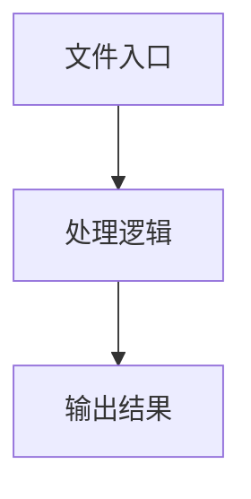

# locator.ts

## 0. 文件概述
locator.ts - TypeScript/JavaScript 源文件

## 1. 核心功能

### 1.1 导出项
- `export const getElementXpath = (`
- `export function getXpathsByPoint(`
- `export function getNodeInfoByXpath(xpath: string): Node | null {`
- `export function getElementInfoByXpath(xpath: string): ElementInfo | null {`

### 1.2 类定义
- 无类定义

### 1.3 函数定义  
- **getXpathsByPoint()**: 函数
- **getNodeInfoByXpath()**: 函数
- **getElementInfoByXpath()**: 函数

### 1.4 常量定义
- **getElementXpathIndex**: 常量
- **normalizeXpathText**: 常量
- **buildCurrentElementXpath**: 常量
- **parentPath**: 常量
- **prefix**: 常量
- **tagName**: 常量
- **textContent**: 常量
- **index**: 常量
- **index**: 常量
- **getElementXpath**: 常量
- **parentNode**: 常量
- **parentXPath**: 常量
- **textContent**: 常量
- **el**: 常量
- **element**: 常量
- **fullXPath**: 常量
- **xpathResult**: 常量
- **node**: 常量
- **node**: 常量
- **rect**: 常量
- **isVisible**: 常量

## 2. 逻辑流程

**流程说明**: 该文件实现特定功能，通过导入依赖模块，定义类/函数/常量，并导出供其他模块使用。

## 3. 关键细节

### 3.1 核心变量
- **getElementXpathIndex**: 定义的常量
- **normalizeXpathText**: 定义的常量
- **buildCurrentElementXpath**: 定义的常量
- **parentPath**: 定义的常量
- **prefix**: 定义的常量
- **tagName**: 定义的常量
- **textContent**: 定义的常量
- **index**: 定义的常量
- **index**: 定义的常量
- **getElementXpath**: 定义的常量
- **parentNode**: 定义的常量
- **parentXPath**: 定义的常量
- **textContent**: 定义的常量
- **el**: 定义的常量
- **element**: 定义的常量
- **fullXPath**: 定义的常量
- **xpathResult**: 定义的常量
- **node**: 定义的常量
- **node**: 定义的常量
- **rect**: 定义的常量
- **isVisible**: 定义的常量

### 3.2 依赖项
- `import type { ElementInfo } from '.';`
- `import type { Point } from '../types';`
- `import { isSvgElement } from './dom-util';`
- `import { getRect, isElementPartiallyInViewport } from './util';`
- `import { collectElementInfo } from './web-extractor';`

## 4. 跨文件调用关系

### 4.1 该文件调用的其他文件
根据 import 语句，该文件依赖以下模块：
- import type { ElementInfo } from '.';
- import type { Point } from '../types';
- import { isSvgElement } from './dom-util';

### 4.2 调用该文件的其他文件
该文件通过以下导出项被其他模块使用：
- export const getElementXpath = (
- export function getXpathsByPoint(
- export function getNodeInfoByXpath(xpath: string): Node | null {
