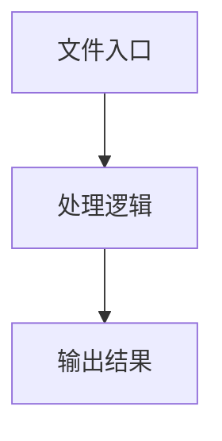

# tree.ts

## 0. 文件概述
tree.ts - TypeScript/JavaScript 源文件

## 1. 核心功能

### 1.1 导出项
- `export function truncateText(`
- `export function trimAttributes(`
- `export function descriptionOfTree<`
- `export function treeToList<T extends BaseElement>(`
- `export function traverseTree<`

### 1.2 类定义
- 无类定义

### 1.3 函数定义  
- **truncateText()**: 函数
- **trimAttributes()**: 函数
- **descriptionOfTree()**: 函数
- **buildContentTree()**: 函数
- **treeToList()**: 函数
- **dfs()**: 函数
- **traverseTree()**: 函数
- **dfs()**: 函数

### 1.4 常量定义
- **tailorAttributes**: 常量
- **attributeVal**: 常量
- **nodeSizeThreshold**: 常量
- **attributesString**: 常量
- **indentStr**: 常量
- **childContent**: 常量
- **rectAttribute**: 常量
- **content**: 常量
- **result**: 常量
- **result**: 常量
- **result**: 常量

## 2. 逻辑流程

**流程说明**: 该文件实现特定功能，通过导入依赖模块，定义类/函数/常量，并导出供其他模块使用。

## 3. 关键细节

### 3.1 核心变量
- **tailorAttributes**: 定义的常量
- **attributeVal**: 定义的常量
- **nodeSizeThreshold**: 定义的常量
- **attributesString**: 定义的常量
- **indentStr**: 定义的常量
- **childContent**: 定义的常量
- **rectAttribute**: 定义的常量
- **content**: 定义的常量
- **result**: 定义的常量
- **result**: 定义的常量
- **result**: 定义的常量

### 3.2 依赖项
- `import type { BaseElement, ElementTreeNode } from '../types';`

## 4. 跨文件调用关系

### 4.1 该文件调用的其他文件
根据 import 语句，该文件依赖以下模块：
- import type { BaseElement, ElementTreeNode } from '../types';

### 4.2 调用该文件的其他文件
该文件通过以下导出项被其他模块使用：
- export function truncateText(
- export function trimAttributes(
- export function descriptionOfTree<
