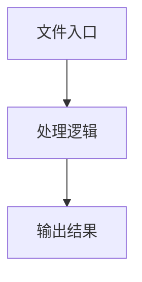

# util.ts

## 0. 文件概述
util.ts - TypeScript/JavaScript 源文件

## 1. 核心功能

### 1.1 导出项
- `export function setDebugMode(mode: boolean) {`
- `export function getDebugMode(): boolean {`
- `export function logger(..._msg: any[]): void {`
- `export function isElementPartiallyInViewport(`
- `export function getPseudoElementContent(`
- `export function hasOverflowY(`
- `export interface ExtractedRect {`
- `export function overlappedRect(`
- `export function getRect(`
- `export function elementRect(`
- `export function validTextNodeContent(node: globalThis.Node): string | false {`
- `export function getNodeAttributes(`
- `export function midsceneGenerateHash(`
- `export function generateId(numberId: number) {`
- `export function setGenerateHashOnWindow() {`
- `export function setMidsceneVisibleRectOnWindow() {`
- `export function setExtractTextWithPositionOnWindow() {`
- `export function getTopDocument(): globalThis.HTMLElement {`

### 1.2 类定义
- 无类定义

### 1.3 函数定义  
- **setDebugMode()**: 函数
- **getDebugMode()**: 函数
- **logger()**: 函数
- **isElementPartiallyInViewport()**: 函数
- **getPseudoElementContent()**: 函数
- **hasOverflowY()**: 函数
- **overlappedRect()**: 函数
- **getRect()**: 函数
- **elementRect()**: 函数
- **validTextNodeContent()**: 函数
- **getNodeAttributes()**: 函数
- **midsceneGenerateHash()**: 函数
- **generateId()**: 函数
- **setGenerateHashOnWindow()**: 函数
- **setMidsceneVisibleRectOnWindow()**: 函数
- **setExtractTextWithPositionOnWindow()**: 函数
- **getTopDocument()**: 函数

### 1.4 常量定义
- **MAX_VALUE_LENGTH**: 常量
- **elementHeight**: 常量
- **elementWidth**: 常量
- **viewportRect**: 常量
- **overlapRect**: 常量
- **visibleArea**: 常量
- **totalArea**: 常量
- **beforeContent**: 常量
- **afterContent**: 常量
- **style**: 常量
- **left**: 常量
- **top**: 常量
- **right**: 常量
- **bottom**: 常量
- **range**: 常量
- **zoom**: 常量
- **isElementCovered**: 常量
- **x**: 常量
- **y**: 常量
- **topElement**: 常量
- **rectOfTopElement**: 常量
- **overlapRect**: 常量
- **style**: 常量
- **rect**: 常量
- **isVisible**: 常量
- **parentUntilNonStatic**: 常量
- **style**: 常量
- **parentStyle**: 常量
- **parentRect**: 常量
- **tolerance**: 常量
- **content**: 常量
- **attributesList**: 常量
- **slicedHash**: 常量
- **container**: 常量

## 2. 逻辑流程

**流程说明**: 该文件实现特定功能，通过导入依赖模块，定义类/函数/常量，并导出供其他模块使用。

## 3. 关键细节

### 3.1 核心变量
- **MAX_VALUE_LENGTH**: 定义的常量
- **elementHeight**: 定义的常量
- **elementWidth**: 定义的常量
- **viewportRect**: 定义的常量
- **overlapRect**: 定义的常量
- **visibleArea**: 定义的常量
- **totalArea**: 定义的常量
- **beforeContent**: 定义的常量
- **afterContent**: 定义的常量
- **style**: 定义的常量
- **left**: 定义的常量
- **top**: 定义的常量
- **right**: 定义的常量
- **bottom**: 定义的常量
- **range**: 定义的常量
- **zoom**: 定义的常量
- **isElementCovered**: 定义的常量
- **x**: 定义的常量
- **y**: 定义的常量
- **topElement**: 定义的常量
- **rectOfTopElement**: 定义的常量
- **overlapRect**: 定义的常量
- **style**: 定义的常量
- **rect**: 定义的常量
- **isVisible**: 定义的常量
- **parentUntilNonStatic**: 定义的常量
- **style**: 定义的常量
- **parentStyle**: 定义的常量
- **parentRect**: 定义的常量
- **tolerance**: 定义的常量
- **content**: 定义的常量
- **attributesList**: 定义的常量
- **slicedHash**: 定义的常量
- **container**: 定义的常量

### 3.2 依赖项
- `import type { Rect } from '../types';`
- `import { generateHashId } from '../utils';`
- `import { extractTextWithPosition } from './web-extractor';`

## 4. 跨文件调用关系

### 4.1 该文件调用的其他文件
根据 import 语句，该文件依赖以下模块：
- import type { Rect } from '../types';
- import { generateHashId } from '../utils';
- import { extractTextWithPosition } from './web-extractor';

### 4.2 调用该文件的其他文件
该文件通过以下导出项被其他模块使用：
- export function setDebugMode(mode: boolean) {
- export function getDebugMode(): boolean {
- export function logger(..._msg: any[]): void {
