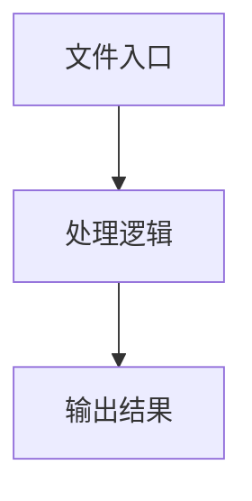

# web-extractor.ts

## 0. 文件概述
web-extractor.ts - TypeScript/JavaScript 源文件

## 1. 核心功能

### 1.1 导出项
- `export function collectElementInfo(`
- `export function extractTextWithPosition(`
- `export function extractTreeNodeAsString(`
- `export function extractTreeNode(`
- `export function mergeElementAndChildrenRects(`

### 1.2 类定义
- 无类定义

### 1.3 函数定义  
- **tagNameOfNode()**: 函数
- **collectElementInfo()**: 函数
- **extractTextWithPosition()**: 函数
- **dfsTopChildren()**: 函数
- **extractTreeNodeAsString()**: 函数
- **extractTreeNode()**: 函数
- **dfs()**: 函数
- **mergeElementAndChildrenRects()**: 函数
- **traverse()**: 函数

### 1.4 常量定义
- **parentElement**: 常量
- **rect**: 常量
- **attributes**: 常量
- **nodeHashId**: 常量
- **tagName**: 常量
- **selectedOption**: 常量
- **elementInfo**: 常量
- **rect**: 常量
- **attributes**: 常量
- **pseudo**: 常量
- **content**: 常量
- **nodeHashId**: 常量
- **elementInfo**: 常量
- **attributes**: 常量
- **nodeHashId**: 常量
- **elementInfo**: 常量
- **text**: 常量
- **attributes**: 常量
- **attributeKeys**: 常量
- **nodeHashId**: 常量
- **elementInfo**: 常量
- **attributes**: 常量
- **pseudo**: 常量
- **content**: 常量
- **nodeHashId**: 常量
- **elementInfo**: 常量
- **attributes**: 常量
- **nodeHashId**: 常量
- **elementInfo**: 常量
- **elementNode**: 常量
- **elementInfoArray**: 常量
- **elementNode**: 常量
- **topDocument**: 常量
- **startNode**: 常量
- **topChildren**: 常量
- **elementInfo**: 常量
- **nodeInfo**: 常量
- **rect**: 常量
- **childNodeInfo**: 常量
- **rootNodeInfo**: 常量
- **iframes**: 常量
- **iframe**: 常量
- **iframeInfo**: 常量
- **iframeChildren**: 常量
- **selfRect**: 常量
- **sub**: 常量
- **rect**: 常量

## 2. 逻辑流程

**流程说明**: 该文件实现特定功能，通过导入依赖模块，定义类/函数/常量，并导出供其他模块使用。

## 3. 关键细节

### 3.1 核心变量
- **parentElement**: 定义的常量
- **rect**: 定义的常量
- **attributes**: 定义的常量
- **nodeHashId**: 定义的常量
- **tagName**: 定义的常量
- **selectedOption**: 定义的常量
- **elementInfo**: 定义的常量
- **rect**: 定义的常量
- **attributes**: 定义的常量
- **pseudo**: 定义的常量
- **content**: 定义的常量
- **nodeHashId**: 定义的常量
- **elementInfo**: 定义的常量
- **attributes**: 定义的常量
- **nodeHashId**: 定义的常量
- **elementInfo**: 定义的常量
- **text**: 定义的常量
- **attributes**: 定义的常量
- **attributeKeys**: 定义的常量
- **nodeHashId**: 定义的常量
- **elementInfo**: 定义的常量
- **attributes**: 定义的常量
- **pseudo**: 定义的常量
- **content**: 定义的常量
- **nodeHashId**: 定义的常量
- **elementInfo**: 定义的常量
- **attributes**: 定义的常量
- **nodeHashId**: 定义的常量
- **elementInfo**: 定义的常量
- **elementNode**: 定义的常量
- **elementInfoArray**: 定义的常量
- **elementNode**: 定义的常量
- **topDocument**: 定义的常量
- **startNode**: 定义的常量
- **topChildren**: 定义的常量
- **elementInfo**: 定义的常量
- **nodeInfo**: 定义的常量
- **rect**: 定义的常量
- **childNodeInfo**: 定义的常量
- **rootNodeInfo**: 定义的常量
- **iframes**: 定义的常量
- **iframe**: 定义的常量
- **iframeInfo**: 定义的常量
- **iframeChildren**: 定义的常量
- **selfRect**: 定义的常量
- **sub**: 定义的常量
- **rect**: 定义的常量

### 3.2 依赖项
- `import {`
- `import type { WebElementInfo } from '../types';`
- `import type { Point } from '../types';`
- `import {`
- `import { descriptionOfTree } from './tree';`

（共 6 个导入项）

## 4. 跨文件调用关系

### 4.1 该文件调用的其他文件
根据 import 语句，该文件依赖以下模块：
- import {
- import type { WebElementInfo } from '../types';
- import type { Point } from '../types';

### 4.2 调用该文件的其他文件
该文件通过以下导出项被其他模块使用：
- export function collectElementInfo(
- export function extractTextWithPosition(
- export function extractTreeNodeAsString(
