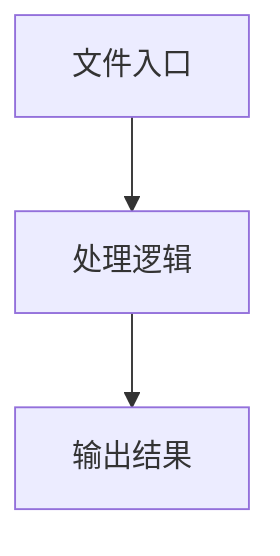

# box-select.ts

## 0. 文件概述
box-select.ts - TypeScript/JavaScript 源文件

## 1. 核心功能

### 1.1 导出项
- `export const compositeElementInfoImg = async (options: {`
- `export const processImageElementInfo = async (options: {`

### 1.2 类定义
- 无类定义

### 1.3 函数定义  
- 无函数定义

### 1.4 常量定义
- **loadFonts**: 常量
- **Jimp**: 常量
- **fonts**: 常量
- **onlineFonts**: 常量
- **fonts**: 常量
- **createSvgOverlay**: 常量
- **Jimp**: 常量
- **image**: 常量
- **colors**: 常量
- **promptPadding**: 常量
- **promptMargin**: 常量
- **promptHeight**: 常量
- **promptY**: 常量
- **element**: 常量
- **color**: 常量
- **paddedLeft**: 常量
- **paddedTop**: 常量
- **paddedWidth**: 常量
- **paddedHeight**: 常量
- **paddedRect**: 常量
- **indexId**: 常量
- **textWidth**: 常量
- **textHeight**: 常量
- **rectWidth**: 常量
- **rectHeight**: 常量
- **checkOverlap**: 常量
- **isWithinBounds**: 常量
- **compositeElementInfoImg**: 常量
- **Jimp**: 常量
- **info**: 常量
- **imageBuffer**: 常量
- **imageBitmap**: 常量
- **result**: 常量
- **svgOverlay**: 常量
- **svgImage**: 常量
- **compositeImage**: 常量
- **base64**: 常量
- **processImageElementInfo**: 常量
- **base64Image**: 常量

## 2. 逻辑流程

**流程说明**: 该文件实现特定功能，通过导入依赖模块，定义类/函数/常量，并导出供其他模块使用。

## 3. 关键细节

### 3.1 核心变量
- **loadFonts**: 定义的常量
- **Jimp**: 定义的常量
- **fonts**: 定义的常量
- **onlineFonts**: 定义的常量
- **fonts**: 定义的常量
- **createSvgOverlay**: 定义的常量
- **Jimp**: 定义的常量
- **image**: 定义的常量
- **colors**: 定义的常量
- **promptPadding**: 定义的常量
- **promptMargin**: 定义的常量
- **promptHeight**: 定义的常量
- **promptY**: 定义的常量
- **element**: 定义的常量
- **color**: 定义的常量
- **paddedLeft**: 定义的常量
- **paddedTop**: 定义的常量
- **paddedWidth**: 定义的常量
- **paddedHeight**: 定义的常量
- **paddedRect**: 定义的常量
- **indexId**: 定义的常量
- **textWidth**: 定义的常量
- **textHeight**: 定义的常量
- **rectWidth**: 定义的常量
- **rectHeight**: 定义的常量
- **checkOverlap**: 定义的常量
- **isWithinBounds**: 定义的常量
- **compositeElementInfoImg**: 定义的常量
- **Jimp**: 定义的常量
- **info**: 定义的常量
- **imageBuffer**: 定义的常量
- **imageBitmap**: 定义的常量
- **result**: 定义的常量
- **svgOverlay**: 定义的常量
- **svgImage**: 定义的常量
- **compositeImage**: 定义的常量
- **base64**: 定义的常量
- **processImageElementInfo**: 定义的常量
- **base64Image**: 定义的常量

### 3.2 依赖项
- `import assert from 'node:assert';`
- `import type Jimp from 'jimp';`
- `import type { BaseElement, Rect } from '../types';`
- `import getJimp from './get-jimp';`
- `import { bufferFromBase64, imageInfoOfBase64 } from './index';`

## 4. 跨文件调用关系

### 4.1 该文件调用的其他文件
根据 import 语句，该文件依赖以下模块：
- import assert from 'node:assert';
- import type Jimp from 'jimp';
- import type { BaseElement, Rect } from '../types';

### 4.2 调用该文件的其他文件
该文件通过以下导出项被其他模块使用：
- export const compositeElementInfoImg = async (options: {
- export const processImageElementInfo = async (options: {
