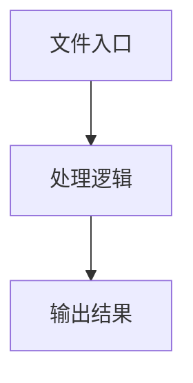

# draw-box.ts

## 0. 文件概述
draw-box.ts - TypeScript/JavaScript 源文件

## 1. 核心功能

### 1.1 导出项
- `export async function drawBoxOnImage(options: {`
- `export async function savePositionImg(options: {`

### 1.2 类定义
- 无类定义

### 1.3 函数定义  
- **drawBoxOnImage()**: 函数
- **savePositionImg()**: 函数

### 1.4 常量定义
- **color**: 常量
- **Jimp**: 常量
- **imageBuffer**: 常量
- **image**: 常量
- **centerX**: 常量
- **centerY**: 常量
- **radius**: 常量
- **distance**: 常量
- **resultBase64**: 常量
- **imgBase64**: 常量

## 2. 逻辑流程

**流程说明**: 该文件实现特定功能，通过导入依赖模块，定义类/函数/常量，并导出供其他模块使用。

## 3. 关键细节

### 3.1 核心变量
- **color**: 定义的常量
- **Jimp**: 定义的常量
- **imageBuffer**: 定义的常量
- **image**: 定义的常量
- **centerX**: 定义的常量
- **centerY**: 定义的常量
- **radius**: 定义的常量
- **distance**: 定义的常量
- **resultBase64**: 定义的常量
- **imgBase64**: 定义的常量

### 3.2 依赖项
- `import type { Rect } from '../types';`
- `import getJimp from './get-jimp';`
- `import { bufferFromBase64 } from './info';`
- `import { saveBase64Image } from './transform';`

## 4. 跨文件调用关系

### 4.1 该文件调用的其他文件
根据 import 语句，该文件依赖以下模块：
- import type { Rect } from '../types';
- import getJimp from './get-jimp';
- import { bufferFromBase64 } from './info';

### 4.2 调用该文件的其他文件
该文件通过以下导出项被其他模块使用：
- export async function drawBoxOnImage(options: {
- export async function savePositionImg(options: {
