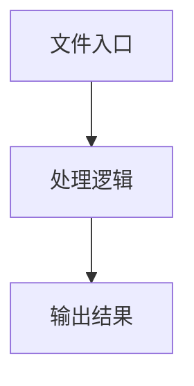

# info.ts

## 0. 文件概述
info.ts - TypeScript/JavaScript 源文件

## 1. 核心功能

### 1.1 导出项
- `export interface ImageInfo extends Size {`
- `export async function imageInfo(`
- `export async function imageInfoOfBase64(`
- `export async function bufferFromBase64(imageBase64: string): Promise<Buffer> {`
- `export function isValidPNGImageBuffer(buffer: Buffer): boolean {`

### 1.2 类定义
- 无类定义

### 1.3 函数定义  
- **imageInfo()**: 函数
- **imageInfoOfBase64()**: 函数
- **to()**: 函数
- **bufferFromBase64()**: 函数
- **isValidPNGImageBuffer()**: 函数

### 1.4 常量定义
- **Jimp**: 常量
- **buffer**: 常量
- **base64Data**: 常量
- **isPNG**: 常量

## 2. 逻辑流程

**流程说明**: 该文件实现特定功能，通过导入依赖模块，定义类/函数/常量，并导出供其他模块使用。

## 3. 关键细节

### 3.1 核心变量
- **Jimp**: 定义的常量
- **buffer**: 定义的常量
- **base64Data**: 定义的常量
- **isPNG**: 定义的常量

### 3.2 依赖项
- `import assert from 'node:assert';`
- `import { Buffer } from 'node:buffer';`
- `import type Jimp from 'jimp';`
- `import type { Size } from '../types';`
- `import getJimp from './get-jimp';`

## 4. 跨文件调用关系

### 4.1 该文件调用的其他文件
根据 import 语句，该文件依赖以下模块：
- import assert from 'node:assert';
- import { Buffer } from 'node:buffer';
- import type Jimp from 'jimp';

### 4.2 调用该文件的其他文件
该文件通过以下导出项被其他模块使用：
- export interface ImageInfo extends Size {
- export async function imageInfo(
- export async function imageInfoOfBase64(
