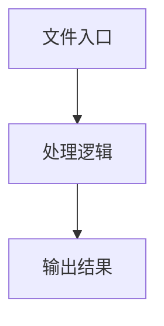

# transform.ts

## 0. 文件概述
transform.ts - TypeScript/JavaScript 源文件

## 1. 核心功能

### 1.1 导出项
- `export async function saveBase64Image(options: {`
- `export async function resizeAndConvertImgBuffer(`
- `export const createImgBase64ByFormat = (format: string, body: string) => {`
- `export async function resizeImgBase64(`
- `export function zoomForGPT4o(originalWidth: number, originalHeight: number) {`
- `export async function jimpFromBase64(base64: string): Promise<Jimp> {`
- `export async function paddingToMatchBlock(`
- `export async function paddingToMatchBlockByBase64(`
- `export async function cropByRect(`
- `export async function jimpToBase64(image: Jimp): Promise<string> {`
- `export const httpImg2Base64 = async (url: string): Promise<string> => {`
- `export const localImg2Base64 = (`
- `export const preProcessImageUrl = async (`
- `export const parseBase64 = (`

### 1.2 类定义
- 无类定义

### 1.3 函数定义  
- **saveBase64Image()**: 函数
- **resizeAndConvertImgBuffer()**: 函数
- **resizeImgBase64()**: 函数
- **is()**: 函数
- **zoomForGPT4o()**: 函数
- **jimpFromBase64()**: 函数
- **paddingToMatchBlock()**: 函数
- **paddingToMatchBlockByBase64()**: 函数
- **cropByRect()**: 函数
- **jimpToBase64()**: 函数

### 1.4 常量定义
- **imgDebug**: 常量
- **imageBuffer**: 常量
- **Jimp**: 常量
- **image**: 常量
- **resizeStartTime**: 常量
- **Sharp**: 常量
- **metadata**: 常量
- **resizedBuffer**: 常量
- **resizeEndTime**: 常量
- **inputBytes**: 常量
- **inputImage**: 常量
- **originalWidth**: 常量
- **originalHeight**: 常量
- **outputImage**: 常量
- **outputBytes**: 常量
- **resizedBuffer**: 常量
- **resizeEndTime**: 常量
- **createImgBase64ByFormat**: 常量
- **imageBuffer**: 常量
- **maxWidth**: 常量
- **maxHeight**: 常量
- **aspectRatio**: 常量
- **Jimp**: 常量
- **imageBuffer**: 常量
- **targetWidth**: 常量
- **targetHeight**: 常量
- **Jimp**: 常量
- **paddedImage**: 常量
- **jimpImage**: 常量
- **paddedResult**: 常量
- **jimpImage**: 常量
- **paddedResult**: 常量
- **Jimp**: 常量
- **httpImg2Base64**: 常量
- **response**: 常量
- **contentType**: 常量
- **buffer**: 常量
- **localImg2Base64**: 常量
- **body**: 常量
- **type**: 常量
- **finalType**: 常量
- **preProcessImageUrl**: 常量
- **parseBase64**: 常量
- **separator**: 常量
- **index**: 常量

## 2. 逻辑流程

**流程说明**: 该文件实现特定功能，通过导入依赖模块，定义类/函数/常量，并导出供其他模块使用。

## 3. 关键细节

### 3.1 核心变量
- **imgDebug**: 定义的常量
- **imageBuffer**: 定义的常量
- **Jimp**: 定义的常量
- **image**: 定义的常量
- **resizeStartTime**: 定义的常量
- **Sharp**: 定义的常量
- **metadata**: 定义的常量
- **resizedBuffer**: 定义的常量
- **resizeEndTime**: 定义的常量
- **inputBytes**: 定义的常量
- **inputImage**: 定义的常量
- **originalWidth**: 定义的常量
- **originalHeight**: 定义的常量
- **outputImage**: 定义的常量
- **outputBytes**: 定义的常量
- **resizedBuffer**: 定义的常量
- **resizeEndTime**: 定义的常量
- **createImgBase64ByFormat**: 定义的常量
- **imageBuffer**: 定义的常量
- **maxWidth**: 定义的常量
- **maxHeight**: 定义的常量
- **aspectRatio**: 定义的常量
- **Jimp**: 定义的常量
- **imageBuffer**: 定义的常量
- **targetWidth**: 定义的常量
- **targetHeight**: 定义的常量
- **Jimp**: 定义的常量
- **paddedImage**: 定义的常量
- **jimpImage**: 定义的常量
- **paddedResult**: 定义的常量
- **jimpImage**: 定义的常量
- **paddedResult**: 定义的常量
- **Jimp**: 定义的常量
- **httpImg2Base64**: 定义的常量
- **response**: 定义的常量
- **contentType**: 定义的常量
- **buffer**: 定义的常量
- **localImg2Base64**: 定义的常量
- **body**: 定义的常量
- **type**: 定义的常量
- **finalType**: 定义的常量
- **preProcessImageUrl**: 定义的常量
- **parseBase64**: 定义的常量
- **separator**: 定义的常量
- **index**: 定义的常量

### 3.2 依赖项
- `import assert from 'node:assert';`
- `import { Buffer } from 'node:buffer';`
- `import { readFileSync } from 'node:fs';`
- `import path from 'node:path';`
- `import type Jimp from 'jimp';`

（共 11 个导入项）

## 4. 跨文件调用关系

### 4.1 该文件调用的其他文件
根据 import 语句，该文件依赖以下模块：
- import assert from 'node:assert';
- import { Buffer } from 'node:buffer';
- import { readFileSync } from 'node:fs';

### 4.2 调用该文件的其他文件
该文件通过以下导出项被其他模块使用：
- export async function saveBase64Image(options: {
- export async function resizeAndConvertImgBuffer(
- export const createImgBase64ByFormat = (format: string, body: string) => {
