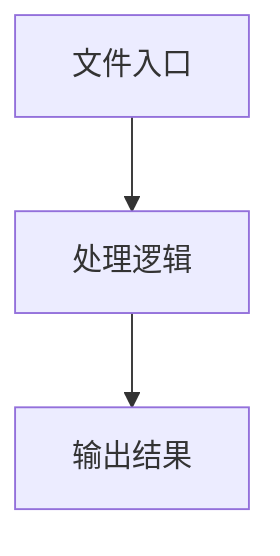

# logger.ts

## 0. 文件概述
logger.ts - TypeScript/JavaScript 源文件

## 1. 核心功能

### 1.1 导出项
- `export type DebugFunction = (...args: unknown[]) => void;`
- `export function getDebug(topic: string): DebugFunction {`
- `export function enableDebug(topic: string): void {`
- `export function cleanupLogStreams(): void {`

### 1.2 类定义
- 无类定义

### 1.3 函数定义  
- **getLogStream()**: 函数
- **writeLogToFile()**: 函数
- **getDebug()**: 函数
- **enableDebug()**: 函数
- **to()**: 函数
- **cleanupLogStreams()**: 函数

### 1.4 常量定义
- **topicPrefix**: 常量
- **logStreams**: 常量
- **debugInstances**: 常量
- **topicFileName**: 常量
- **logFile**: 常量
- **stream**: 常量
- **stream**: 常量
- **now**: 常量
- **isoDate**: 常量
- **isoTime**: 常量
- **milliseconds**: 常量
- **timezoneOffsetMinutes**: 常量
- **sign**: 常量
- **hours**: 常量
- **minutes**: 常量
- **timezoneString**: 常量
- **localISOTime**: 常量
- **fullTopic**: 常量
- **debugFn**: 常量
- **wrapper**: 常量
- **message**: 常量

## 2. 逻辑流程

**流程说明**: 该文件实现特定功能，通过导入依赖模块，定义类/函数/常量，并导出供其他模块使用。

## 3. 关键细节

### 3.1 核心变量
- **topicPrefix**: 定义的常量
- **logStreams**: 定义的常量
- **debugInstances**: 定义的常量
- **topicFileName**: 定义的常量
- **logFile**: 定义的常量
- **stream**: 定义的常量
- **stream**: 定义的常量
- **now**: 定义的常量
- **isoDate**: 定义的常量
- **isoTime**: 定义的常量
- **milliseconds**: 定义的常量
- **timezoneOffsetMinutes**: 定义的常量
- **sign**: 定义的常量
- **hours**: 定义的常量
- **minutes**: 定义的常量
- **timezoneString**: 定义的常量
- **localISOTime**: 定义的常量
- **fullTopic**: 定义的常量
- **debugFn**: 定义的常量
- **wrapper**: 定义的常量
- **message**: 定义的常量

### 3.2 依赖项
- `import fs from 'node:fs';`
- `import path from 'node:path';`
- `import util from 'node:util';`
- `import debug from 'debug';`
- `import { getMidsceneRunSubDir } from './common';`

（共 6 个导入项）

## 4. 跨文件调用关系

### 4.1 该文件调用的其他文件
根据 import 语句，该文件依赖以下模块：
- import fs from 'node:fs';
- import path from 'node:path';
- import util from 'node:util';

### 4.2 调用该文件的其他文件
该文件通过以下导出项被其他模块使用：
- export type DebugFunction = (...args: unknown[]) => void;
- export function getDebug(topic: string): DebugFunction {
- export function enableDebug(topic: string): void {
