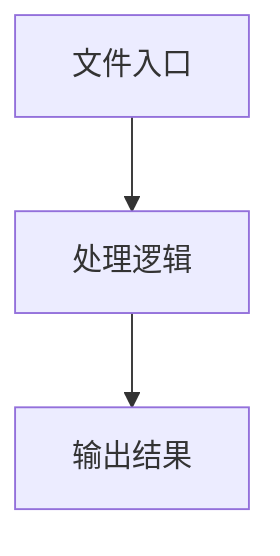

# base-server.ts

## 0. 文件概述
base-server.ts - TypeScript/JavaScript 源文件

## 1. 核心功能

### 1.1 导出项
- `export interface BaseMCPServerConfig {`
- `export interface HttpLaunchOptions {`
- `export const CLI_ARGS_CONFIG: ParseArgsConfig['options'] = {`
- `export interface CLIArgs {`
- `export function launchMCPServer(`
- `export abstract class BaseMCPServer {`

### 1.2 类定义
- **with**: 类定义
- **BaseMCPServer**: 类定义

### 1.3 函数定义  
- **launchMCPServer()**: 函数

### 1.4 常量定义
- **CLI_ARGS_CONFIG**: 常量
- **SESSION_TIMEOUT_MS**: 常量
- **CLEANUP_INTERVAL_MS**: 常量
- **MAX_SESSIONS**: 常量
- **message**: 常量
- **transport**: 常量
- **message**: 常量
- **cleanup**: 常量
- **app**: 常量
- **sessions**: 常量
- **startTime**: 常量
- **requestId**: 常量
- **rawSessionId**: 常量
- **sessionId**: 常量
- **duration**: 常量
- **message**: 常量
- **duration**: 常量
- **host**: 常量
- **server**: 常量
- **cleanupInterval**: 常量
- **transport**: 常量
- **message**: 常量
- **now**: 常量
- **message**: 常量
- **cleanup**: 常量
- **message**: 常量
- **message**: 常量

## 2. 逻辑流程

**流程说明**: 该文件实现特定功能，通过导入依赖模块，定义类/函数/常量，并导出供其他模块使用。

## 3. 关键细节

### 3.1 核心变量
- **CLI_ARGS_CONFIG**: 定义的常量
- **SESSION_TIMEOUT_MS**: 定义的常量
- **CLEANUP_INTERVAL_MS**: 定义的常量
- **MAX_SESSIONS**: 定义的常量
- **message**: 定义的常量
- **transport**: 定义的常量
- **message**: 定义的常量
- **cleanup**: 定义的常量
- **app**: 定义的常量
- **sessions**: 定义的常量
- **startTime**: 定义的常量
- **requestId**: 定义的常量
- **rawSessionId**: 定义的常量
- **sessionId**: 定义的常量
- **duration**: 定义的常量
- **message**: 定义的常量
- **duration**: 定义的常量
- **host**: 定义的常量
- **server**: 定义的常量
- **cleanupInterval**: 定义的常量
- **transport**: 定义的常量
- **message**: 定义的常量
- **now**: 定义的常量
- **message**: 定义的常量
- **cleanup**: 定义的常量
- **message**: 定义的常量
- **message**: 定义的常量

### 3.2 依赖项
- `import { randomUUID } from 'node:crypto';`
- `import type { ParseArgsConfig } from 'node:util';`
- `import { setIsMcp } from '@midscene/shared/utils';`
- `import { McpServer } from '@modelcontextprotocol/sdk/server/mcp.js';`
- `import { StdioServerTransport } from '@modelcontextprotocol/sdk/server/stdio.js';`

（共 8 个导入项）

## 4. 跨文件调用关系

### 4.1 该文件调用的其他文件
根据 import 语句，该文件依赖以下模块：
- import { randomUUID } from 'node:crypto';
- import type { ParseArgsConfig } from 'node:util';
- import { setIsMcp } from '@midscene/shared/utils';

### 4.2 调用该文件的其他文件
该文件通过以下导出项被其他模块使用：
- export interface BaseMCPServerConfig {
- export interface HttpLaunchOptions {
- export const CLI_ARGS_CONFIG: ParseArgsConfig['options'] = {
