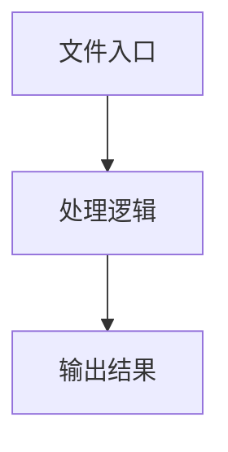

# tool-generator.ts

## 0. 文件概述
tool-generator.ts - TypeScript/JavaScript 源文件

## 1. 核心功能

### 1.1 导出项
- `export function generateToolsFromActionSpace(`
- `export function generateCommonTools(`

### 1.2 类定义
- 无类定义

### 1.3 函数定义  
- **getErrorMessage()**: 函数
- **describeActionForMCP()**: 函数
- **isZodOptional()**: 函数
- **isZodObject()**: 函数
- **unwrapOptional()**: 函数
- **isLocateField()**: 函数
- **makePromptOptional()**: 函数
- **transformSchemaField()**: 函数
- **extractActionSchema()**: 函数
- **serializeArgsToDescription()**: 函数
- **buildActionInstruction()**: 函数
- **captureScreenshotResult()**: 函数
- **createErrorResult()**: 函数
- **generateToolsFromActionSpace()**: 函数
- **generateCommonTools()**: 函数

### 1.4 常量定义
- **actionDesc**: 常量
- **schema**: 常量
- **isZodObjectType**: 常量
- **typeName**: 常量
- **description**: 常量
- **paramDesc**: 常量
- **paramDescriptions**: 常量
- **isFieldOptional**: 常量
- **typeName**: 常量
- **description**: 常量
- **newShape**: 常量
- **schema**: 常量
- **errorMessage**: 常量
- **argsDescription**: 常量
- **screenshot**: 常量
- **errorMessage**: 常量
- **schema**: 常量
- **agent**: 常量
- **instruction**: 常量
- **errorMessage**: 常量
- **errorMessage**: 常量
- **agent**: 常量
- **screenshot**: 常量
- **errorMessage**: 常量

## 2. 逻辑流程

**流程说明**: 该文件实现特定功能，通过导入依赖模块，定义类/函数/常量，并导出供其他模块使用。

## 3. 关键细节

### 3.1 核心变量
- **actionDesc**: 定义的常量
- **schema**: 定义的常量
- **isZodObjectType**: 定义的常量
- **typeName**: 定义的常量
- **description**: 定义的常量
- **paramDesc**: 定义的常量
- **paramDescriptions**: 定义的常量
- **isFieldOptional**: 定义的常量
- **typeName**: 定义的常量
- **description**: 定义的常量
- **newShape**: 定义的常量
- **schema**: 定义的常量
- **errorMessage**: 定义的常量
- **argsDescription**: 定义的常量
- **screenshot**: 定义的常量
- **errorMessage**: 定义的常量
- **schema**: 定义的常量
- **agent**: 定义的常量
- **instruction**: 定义的常量
- **errorMessage**: 定义的常量
- **errorMessage**: 定义的常量
- **agent**: 定义的常量
- **screenshot**: 定义的常量
- **errorMessage**: 定义的常量

### 3.2 依赖项
- `import { parseBase64 } from '@midscene/shared/img';`
- `import { z } from 'zod';`
- `import { getZodDescription, getZodTypeName } from '../zod-schema-utils';`
- `import type {`

## 4. 跨文件调用关系

### 4.1 该文件调用的其他文件
根据 import 语句，该文件依赖以下模块：
- import { parseBase64 } from '@midscene/shared/img';
- import { z } from 'zod';
- import { getZodDescription, getZodTypeName } from '../zod-schema-utils';

### 4.2 调用该文件的其他文件
该文件通过以下导出项被其他模块使用：
- export function generateToolsFromActionSpace(
- export function generateCommonTools(
