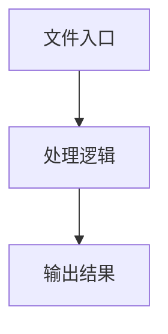

# us-keyboard-layout.ts

## 0. 文件概述
us-keyboard-layout.ts - TypeScript/JavaScript 源文件

## 1. 核心功能

### 1.1 导出项
- `export interface KeyDefinition {`
- `export type KeyInput =`
- `export const _keyDefinitions: Readonly<Record<KeyInput, KeyDefinition>> = {`
- `export const getKeyDefinition = (key: string): KeyInput => {`
- `export const isMac =`
- `export function transformHotkeyInput(keyInput: string): string[] {`

### 1.2 类定义
- 无类定义

### 1.3 函数定义  
- **transformHotkeyInput()**: 函数

### 1.4 常量定义
- **_keyDefinitions**: 常量
- **lowerCaseKeyDefinitions**: 常量
- **lowerKey**: 常量
- **getKeyDefinition**: 常量
- **lowerKey**: 常量
- **isMac**: 常量
- **keyMap**: 常量

## 2. 逻辑流程

**流程说明**: 该文件实现特定功能，通过导入依赖模块，定义类/函数/常量，并导出供其他模块使用。

## 3. 关键细节

### 3.1 核心变量
- **_keyDefinitions**: 定义的常量
- **lowerCaseKeyDefinitions**: 定义的常量
- **lowerKey**: 定义的常量
- **getKeyDefinition**: 定义的常量
- **lowerKey**: 定义的常量
- **isMac**: 定义的常量
- **keyMap**: 定义的常量

### 3.2 依赖项
- 无外部依赖

## 4. 跨文件调用关系

### 4.1 该文件调用的其他文件
- 无外部调用

### 4.2 调用该文件的其他文件
该文件通过以下导出项被其他模块使用：
- export interface KeyDefinition {
- export type KeyInput =
- export const _keyDefinitions: Readonly<Record<KeyInput, KeyDefinition>> = {
