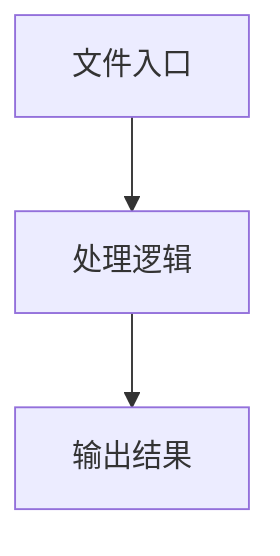

# utils.ts

## 0. 文件概述
utils.ts - TypeScript/JavaScript 源文件

## 1. 核心功能

### 1.1 导出项
- `export const ifInBrowser = typeof window !== 'undefined';`
- `export const ifInWorker = typeof WorkerGlobalScope !== 'undefined';`
- `export const ifInNode =`
- `export function uuid(): string {`
- `export function generateHashId(rect: any, content = ''): string {`
- `export function assert(condition: any, message?: string): asserts condition {`
- `export function getGlobalScope(): GlobalScope {`
- `export function setIsMcp(value: boolean) {`
- `export function logMsg(...message: Parameters<typeof console.log>) {`
- `export async function repeat(`
- `export const escapeScriptTag = (html: string) => {`
- `export const antiEscapeScriptTag = (html: string) => {`
- `export function replaceIllegalPathCharsAndSpace(str: string) {`

### 1.2 类定义
- 无类定义

### 1.3 函数定义  
- **uuid()**: 函数
- **generateHashId()**: 函数
- **that()**: 函数
- **assert()**: 函数
- **getGlobalScope()**: 函数
- **setIsMcp()**: 函数
- **logMsg()**: 函数
- **repeat()**: 函数
- **replaceIllegalPathCharsAndSpace()**: 函数

### 1.4 常量定义
- **ifInBrowser**: 常量
- **ifInWorker**: 常量
- **ifInNode**: 常量
- **hashMap**: 常量
- **combined**: 常量
- **hashHex**: 常量
- **toLetters**: 常量
- **code**: 常量
- **hashLetters**: 常量
- **REGEXP_LT**: 常量
- **REGEXP_GT**: 常量
- **REGEXP_LT_ESCAPE**: 常量
- **REGEXP_GT_ESCAPE**: 常量
- **escapeScriptTag**: 常量
- **antiEscapeScriptTag**: 常量
- **REGEXP_LT**: 常量
- **REGEXP_GT**: 常量

## 2. 逻辑流程

**流程说明**: 该文件实现特定功能，通过导入依赖模块，定义类/函数/常量，并导出供其他模块使用。

## 3. 关键细节

### 3.1 核心变量
- **ifInBrowser**: 定义的常量
- **ifInWorker**: 定义的常量
- **ifInNode**: 定义的常量
- **hashMap**: 定义的常量
- **combined**: 定义的常量
- **hashHex**: 定义的常量
- **toLetters**: 定义的常量
- **code**: 定义的常量
- **hashLetters**: 定义的常量
- **REGEXP_LT**: 定义的常量
- **REGEXP_GT**: 定义的常量
- **REGEXP_LT_ESCAPE**: 定义的常量
- **REGEXP_GT_ESCAPE**: 定义的常量
- **escapeScriptTag**: 定义的常量
- **antiEscapeScriptTag**: 定义的常量
- **REGEXP_LT**: 定义的常量
- **REGEXP_GT**: 定义的常量

### 3.2 依赖项
- `import { sha256 } from 'js-sha256';`
- `import { v4 as generateUUID } from 'uuid';`

## 4. 跨文件调用关系

### 4.1 该文件调用的其他文件
根据 import 语句，该文件依赖以下模块：
- import { sha256 } from 'js-sha256';
- import { v4 as generateUUID } from 'uuid';

### 4.2 调用该文件的其他文件
该文件通过以下导出项被其他模块使用：
- export const ifInBrowser = typeof window !== 'undefined';
- export const ifInWorker = typeof WorkerGlobalScope !== 'undefined';
- export const ifInNode =
