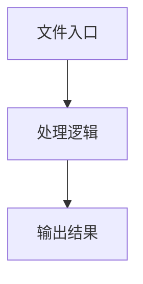

# zod-schema-utils.ts

## 0. 文件概述
zod-schema-utils.ts - TypeScript/JavaScript 源文件

## 1. 核心功能

### 1.1 导出项
- `export function unwrapZodField(field: unknown): unknown {`
- `export function isMidsceneLocatorField(field: unknown): boolean {`
- `export function getZodTypeName(`
- `export function getZodDescription(field: z.ZodTypeAny): string | null {`

### 1.2 类定义
- 无类定义

### 1.3 函数定义  
- **unwrapZodField()**: 函数
- **isMidsceneLocatorField()**: 函数
- **getZodTypeName()**: 函数
- **getZodDescription()**: 函数

### 1.4 常量定义
- **f**: 常量
- **typeName**: 常量
- **actualField**: 常量
- **shape**: 常量
- **actualField**: 常量
- **fieldTypeName**: 常量
- **values**: 常量
- **options**: 常量
- **types**: 常量
- **actualField**: 常量

## 2. 逻辑流程

**流程说明**: 该文件实现特定功能，通过导入依赖模块，定义类/函数/常量，并导出供其他模块使用。

## 3. 关键细节

### 3.1 核心变量
- **f**: 定义的常量
- **typeName**: 定义的常量
- **actualField**: 定义的常量
- **shape**: 定义的常量
- **actualField**: 定义的常量
- **fieldTypeName**: 定义的常量
- **values**: 定义的常量
- **options**: 定义的常量
- **types**: 定义的常量
- **actualField**: 定义的常量

### 3.2 依赖项
- `import type { z } from 'zod';`

## 4. 跨文件调用关系

### 4.1 该文件调用的其他文件
根据 import 语句，该文件依赖以下模块：
- import type { z } from 'zod';

### 4.2 调用该文件的其他文件
该文件通过以下导出项被其他模块使用：
- export function unwrapZodField(field: unknown): unknown {
- export function isMidsceneLocatorField(field: unknown): boolean {
- export function getZodTypeName(
