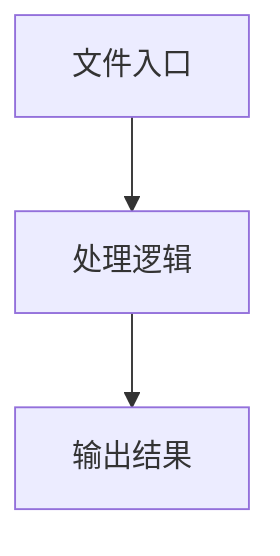

# index.tsx

## 0. 文件概述
index.tsx - TypeScript/JavaScript 源文件

## 1. 核心功能

### 1.1 导出项
- `export const pointMarkForItem = (`
- `export const rectMarkForItem = (`
- `export const Blackboard = (props: {`
- `export default Blackboard;`

### 1.2 类定义
- 无类定义

### 1.3 函数定义  
- 无函数定义

### 1.4 常量定义
- **itemFillAlpha**: 常量
- **highlightAlpha**: 常量
- **pointRadius**: 常量
- **pointMarkForItem**: 常量
- **themeColor**: 常量
- **graphics**: 常量
- **rectMarkForItem**: 常量
- **alpha**: 常量
- **graphics**: 常量
- **dropShadowFilter**: 常量
- **nameFontSize**: 常量
- **texts**: 常量
- **Blackboard**: 常量
- **highlightElements**: 常量
- **highlightIds**: 常量
- **highlightRect**: 常量
- **highlightPoints**: 常量
- **context**: 常量
- **screenWidth**: 常量
- **screenHeight**: 常量
- **domRef**: 常量
- **app**: 常量
- **highlightContainer**: 常量
- **elementMarkContainer**: 常量
- **pixiBgRef**: 常量
- **animationFrameRef**: 常量
- **highlightGraphicsRef**: 常量
- **glowFiltersRef**: 常量
- **backgroundVisible**: 常量
- **elementsVisible**: 常量
- **canvasEl**: 常量
- **targetHeight**: 常量
- **viewportRatio**: 常量
- **ratio**: 常量
- **clickHandler**: 常量
- **img**: 常量
- **screenshotTexture**: 常量
- **backgroundSprite**: 常量
- **highlightElementRects**: 常量
- **items**: 常量
- **graphics**: 常量
- **glowFilter**: 常量
- **existingFilters**: 常量
- **graphics**: 常量
- **glowFilter**: 常量
- **graphicsToAnimate**: 常量
- **glowFilters**: 常量
- **pulseDuration**: 常量
- **minAlpha**: 常量
- **maxAlpha**: 常量
- **minGlowStrength**: 常量
- **maxGlowStrength**: 常量
- **startTime**: 常量
- **animate**: 常量
- **elapsed**: 常量
- **progress**: 常量
- **sineValue**: 常量
- **normalizedSine**: 常量
- **alpha**: 常量
- **glowStrength**: 常量

## 2. 逻辑流程

**流程说明**: 该文件实现特定功能，通过导入依赖模块，定义类/函数/常量，并导出供其他模块使用。

## 3. 关键细节

### 3.1 核心变量
- **itemFillAlpha**: 定义的常量
- **highlightAlpha**: 定义的常量
- **pointRadius**: 定义的常量
- **pointMarkForItem**: 定义的常量
- **themeColor**: 定义的常量
- **graphics**: 定义的常量
- **rectMarkForItem**: 定义的常量
- **alpha**: 定义的常量
- **graphics**: 定义的常量
- **dropShadowFilter**: 定义的常量
- **nameFontSize**: 定义的常量
- **texts**: 定义的常量
- **Blackboard**: 定义的常量
- **highlightElements**: 定义的常量
- **highlightIds**: 定义的常量
- **highlightRect**: 定义的常量
- **highlightPoints**: 定义的常量
- **context**: 定义的常量
- **screenWidth**: 定义的常量
- **screenHeight**: 定义的常量
- **domRef**: 定义的常量
- **app**: 定义的常量
- **highlightContainer**: 定义的常量
- **elementMarkContainer**: 定义的常量
- **pixiBgRef**: 定义的常量
- **animationFrameRef**: 定义的常量
- **highlightGraphicsRef**: 定义的常量
- **glowFiltersRef**: 定义的常量
- **backgroundVisible**: 定义的常量
- **elementsVisible**: 定义的常量
- **canvasEl**: 定义的常量
- **targetHeight**: 定义的常量
- **viewportRatio**: 定义的常量
- **ratio**: 定义的常量
- **clickHandler**: 定义的常量
- **img**: 定义的常量
- **screenshotTexture**: 定义的常量
- **backgroundSprite**: 定义的常量
- **highlightElementRects**: 定义的常量
- **items**: 定义的常量
- **graphics**: 定义的常量
- **glowFilter**: 定义的常量
- **existingFilters**: 定义的常量
- **graphics**: 定义的常量
- **glowFilter**: 定义的常量
- **graphicsToAnimate**: 定义的常量
- **glowFilters**: 定义的常量
- **pulseDuration**: 定义的常量
- **minAlpha**: 定义的常量
- **maxAlpha**: 定义的常量
- **minGlowStrength**: 定义的常量
- **maxGlowStrength**: 定义的常量
- **startTime**: 定义的常量
- **animate**: 定义的常量
- **elapsed**: 定义的常量
- **progress**: 定义的常量
- **sineValue**: 定义的常量
- **normalizedSine**: 定义的常量
- **alpha**: 定义的常量
- **glowStrength**: 定义的常量

### 3.2 依赖项
- `import 'pixi.js/unsafe-eval';`
- `import type { BaseElement, Rect, UIContext } from '@midscene/core';`
- `import { Checkbox } from 'antd';`
- `import type { CheckboxProps } from 'antd';`
- `import * as PIXI from 'pixi.js';`

（共 11 个导入项）

## 4. 跨文件调用关系

### 4.1 该文件调用的其他文件
根据 import 语句，该文件依赖以下模块：
- import 'pixi.js/unsafe-eval';
- import type { BaseElement, Rect, UIContext } from '@midscene/core';
- import { Checkbox } from 'antd';

### 4.2 调用该文件的其他文件
该文件通过以下导出项被其他模块使用：
- export const pointMarkForItem = (
- export const rectMarkForItem = (
- export const Blackboard = (props: {
