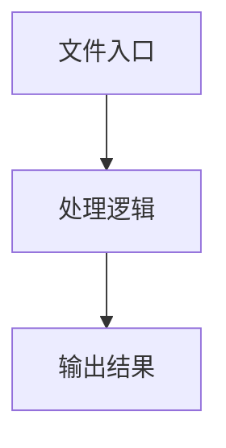

# index.tsx

## 0. 文件概述
index.tsx - TypeScript/JavaScript 源文件

## 1. 核心功能

### 1.1 导出项
- `export const ConfigSelector: React.FC<ConfigSelectorProps> = ({`

### 1.2 类定义
- 无类定义

### 1.3 函数定义  
- **buildConfigItems()**: 函数

### 1.4 常量定义
- **ConfigSelector**: 常量
- **forceSameTabNavigation**: 常量
- **setForceSameTabNavigation**: 常量
- **deepThink**: 常量
- **setDeepThink**: 常量
- **screenshotIncluded**: 常量
- **setScreenshotIncluded**: 常量
- **domIncluded**: 常量
- **setDomIncluded**: 常量
- **imeStrategy**: 常量
- **setImeStrategy**: 常量
- **autoDismissKeyboard**: 常量
- **setAutoDismissKeyboard**: 常量
- **keyboardDismissStrategy**: 常量
- **setKeyboardDismissStrategy**: 常量
- **alwaysRefreshScreenInfo**: 常量
- **setAlwaysRefreshScreenInfo**: 常量
- **hasDeviceOptions**: 常量
- **configItems**: 常量
- **items**: 常量

## 2. 逻辑流程

**流程说明**: 该文件实现特定功能，通过导入依赖模块，定义类/函数/常量，并导出供其他模块使用。

## 3. 关键细节

### 3.1 核心变量
- **ConfigSelector**: 定义的常量
- **forceSameTabNavigation**: 定义的常量
- **setForceSameTabNavigation**: 定义的常量
- **deepThink**: 定义的常量
- **setDeepThink**: 定义的常量
- **screenshotIncluded**: 定义的常量
- **setScreenshotIncluded**: 定义的常量
- **domIncluded**: 定义的常量
- **setDomIncluded**: 定义的常量
- **imeStrategy**: 定义的常量
- **setImeStrategy**: 定义的常量
- **autoDismissKeyboard**: 定义的常量
- **setAutoDismissKeyboard**: 定义的常量
- **keyboardDismissStrategy**: 定义的常量
- **setKeyboardDismissStrategy**: 定义的常量
- **alwaysRefreshScreenInfo**: 定义的常量
- **setAlwaysRefreshScreenInfo**: 定义的常量
- **hasDeviceOptions**: 定义的常量
- **configItems**: 定义的常量
- **items**: 定义的常量

### 3.2 依赖项
- `import { Checkbox, Dropdown, type MenuProps, Radio } from 'antd';`
- `import type React from 'react';`
- `import SettingOutlined from '../../icons/setting.svg';`
- `import { useEnvConfig } from '../../store/store';`
- `import type { DeviceType } from '../../types';`

（共 6 个导入项）

## 4. 跨文件调用关系

### 4.1 该文件调用的其他文件
根据 import 语句，该文件依赖以下模块：
- import { Checkbox, Dropdown, type MenuProps, Radio } from 'antd';
- import type React from 'react';
- import SettingOutlined from '../../icons/setting.svg';

### 4.2 调用该文件的其他文件
该文件通过以下导出项被其他模块使用：
- export const ConfigSelector: React.FC<ConfigSelectorProps> = ({
