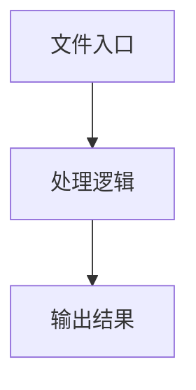

# index.tsx

## 0. 文件概述
index.tsx - TypeScript/JavaScript 源文件

## 1. 核心功能

### 1.1 导出项
- `export const TextField: React.FC<Omit<FormFieldProps, 'isLocateField'>> = ({`
- `export const LocateField: React.FC<Omit<FormFieldProps, 'isLocateField'>> = ({`
- `export const EnumField: React.FC<Omit<FormFieldProps, 'isLocateField'>> = ({`
- `export const NumberField: React.FC<Omit<FormFieldProps, 'isLocateField'>> = ({`
- `export const BooleanField: React.FC<Omit<FormFieldProps, 'isLocateField'>> = ({`

### 1.2 类定义
- 无类定义

### 1.3 函数定义  
- 无函数定义

### 1.4 常量定义
- **renderLabel**: 常量
- **TextField**: 常量
- **placeholder**: 常量
- **LocateField**: 常量
- **placeholder**: 常量
- **EnumField**: 常量
- **enumValues**: 常量
- **selectOptions**: 常量
- **NumberField**: 常量
- **defaultPlaceholder**: 常量
- **placeholderValue**: 常量
- **min**: 常量
- **max**: 常量
- **BooleanField**: 常量
- **selectOptions**: 常量

## 2. 逻辑流程

**流程说明**: 该文件实现特定功能，通过导入依赖模块，定义类/函数/常量，并导出供其他模块使用。

## 3. 关键细节

### 3.1 核心变量
- **renderLabel**: 定义的常量
- **TextField**: 定义的常量
- **placeholder**: 定义的常量
- **LocateField**: 定义的常量
- **placeholder**: 定义的常量
- **EnumField**: 定义的常量
- **enumValues**: 定义的常量
- **selectOptions**: 定义的常量
- **NumberField**: 定义的常量
- **defaultPlaceholder**: 定义的常量
- **placeholderValue**: 定义的常量
- **min**: 定义的常量
- **max**: 定义的常量
- **BooleanField**: 定义的常量
- **selectOptions**: 定义的常量

### 3.2 依赖项
- `import type { z } from '@midscene/core';`
- `import { Form, Input, InputNumber, Select } from 'antd';`
- `import type React from 'react';`
- `import type { ZodRuntimeAccess } from '../../types';`

## 4. 跨文件调用关系

### 4.1 该文件调用的其他文件
根据 import 语句，该文件依赖以下模块：
- import type { z } from '@midscene/core';
- import { Form, Input, InputNumber, Select } from 'antd';
- import type React from 'react';

### 4.2 调用该文件的其他文件
该文件通过以下导出项被其他模块使用：
- export const TextField: React.FC<Omit<FormFieldProps, 'isLocateField'>> = ({
- export const LocateField: React.FC<Omit<FormFieldProps, 'isLocateField'>> = ({
- export const EnumField: React.FC<Omit<FormFieldProps, 'isLocateField'>> = ({
