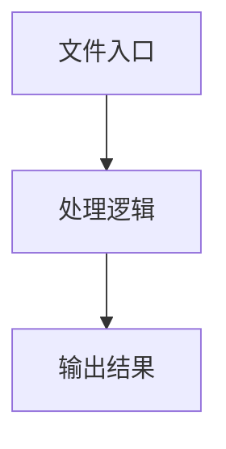

# index.tsx

## 0. 文件概述
index.tsx - TypeScript/JavaScript 源文件

## 1. 核心功能

### 1.1 导出项
- `export const HistorySelector: React.FC<HistorySelectorProps> = ({`

### 1.2 类定义
- 无类定义

### 1.3 函数定义  
- 无函数定义

### 1.4 常量定义
- **HistorySelector**: 常量
- **clearHistory**: 常量
- **modalRef**: 常量
- **groupedHistory**: 常量
- **now**: 常量
- **sevenDaysAgo**: 常量
- **oneYearAgo**: 常量
- **filteredHistory**: 常量
- **groups**: 常量
- **handleHistoryClick**: 常量
- **handleClearHistory**: 常量
- **handleClickOutside**: 常量
- **timer**: 常量
- **renderHistoryGroup**: 常量

## 2. 逻辑流程

**流程说明**: 该文件实现特定功能，通过导入依赖模块，定义类/函数/常量，并导出供其他模块使用。

## 3. 关键细节

### 3.1 核心变量
- **HistorySelector**: 定义的常量
- **clearHistory**: 定义的常量
- **modalRef**: 定义的常量
- **groupedHistory**: 定义的常量
- **now**: 定义的常量
- **sevenDaysAgo**: 定义的常量
- **oneYearAgo**: 定义的常量
- **filteredHistory**: 定义的常量
- **groups**: 定义的常量
- **handleHistoryClick**: 定义的常量
- **handleClearHistory**: 定义的常量
- **handleClickOutside**: 定义的常量
- **timer**: 定义的常量
- **renderHistoryGroup**: 定义的常量

### 3.2 依赖项
- `import { Button, Input, Typography } from 'antd';`
- `import type React from 'react';`
- `import { useEffect, useMemo, useRef, useState } from 'react';`
- `import CloseOutlined from '../../icons/close.svg';`
- `import HistoryOutlined from '../../icons/history.svg';`

（共 9 个导入项）

## 4. 跨文件调用关系

### 4.1 该文件调用的其他文件
根据 import 语句，该文件依赖以下模块：
- import { Button, Input, Typography } from 'antd';
- import type React from 'react';
- import { useEffect, useMemo, useRef, useState } from 'react';

### 4.2 调用该文件的其他文件
该文件通过以下导出项被其他模块使用：
- export const HistorySelector: React.FC<HistorySelectorProps> = ({
