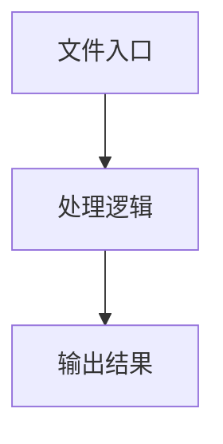

# index.tsx

## 0. 文件概述
index.tsx - TypeScript/JavaScript 源文件

## 1. 核心功能

### 1.1 导出项
- `export function Player(props?: {`

### 1.2 类定义
- **RecordingSession**: 类定义

### 1.3 函数定义  
- **Player()**: 函数

### 1.4 常量定义
- **canvasPaddingLeft**: 常量
- **canvasPaddingTop**: 常量
- **cubicBezier**: 常量
- **t2**: 常量
- **cubicImage**: 常量
- **cubicInsightElement**: 常量
- **cubicMouse**: 常量
- **linear**: 常量
- **sleep**: 常量
- **ERROR_FRAME_CANCEL**: 常量
- **frameKit**: 常量
- **singleElementFadeInDuration**: 常量
- **LAYER_ORDER_IMG**: 常量
- **LAYER_ORDER_INSIGHT**: 常量
- **LAYER_ORDER_POINTER**: 常量
- **LAYER_ORDER_SPINNING_POINTER**: 常量
- **downloadReport**: 常量
- **blob**: 常量
- **url**: 常量
- **a**: 常量
- **stream**: 常量
- **mediaRecorder**: 常量
- **blob**: 常量
- **url**: 常量
- **a**: 常量
- **scripts**: 常量
- **imageWidth**: 常量
- **imageHeight**: 常量
- **fitMode**: 常量
- **currentImg**: 常量
- **divContainerRef**: 常量
- **app**: 常量
- **pointerSprite**: 常量
- **spinningPointerSprite**: 常量
- **triggerReplay**: 常量
- **windowContentContainer**: 常量
- **container**: 常量
- **insightMarkContainer**: 常量
- **container**: 常量
- **basicCameraState**: 常量
- **cancelFlag**: 常量
- **cameraState**: 常量
- **resizeCanvasIfNeeded**: 常量
- **aspectRatio**: 常量
- **newBasicCameraState**: 常量
- **repaintImage**: 常量
- **imgToUpdate**: 常量
- **targetWidth**: 常量
- **targetHeight**: 常量
- **texture**: 常量
- **sprite**: 常量
- **mainImgLabel**: 常量
- **child**: 常量
- **spinningPointer**: 常量
- **animate**: 常量
- **elapsedTime**: 常量
- **progress**: 常量
- **rotation**: 常量
- **stopFn**: 常量
- **updatePointer**: 常量
- **texture**: 常量
- **sprite**: 常量
- **pointer**: 常量
- **updateCamera**: 常量
- **effectiveWidth**: 常量
- **newScale**: 常量
- **pointer**: 常量
- **cameraAnimation**: 常量
- **currentCanvasWidth**: 常量
- **currentCanvasHeight**: 常量
- **currentState**: 常量
- **startPointerLeft**: 常量
- **startPointerTop**: 常量
- **startTime**: 常量
- **shouldMovePointer**: 常量
- **animate**: 常量
- **elapsedTime**: 常量
- **rawProgress**: 常量
- **progress**: 常量
- **nextState**: 常量
- **currentState**: 常量
- **startLeft**: 常量
- **startTop**: 常量
- **startPointerLeft**: 常量
- **startPointerTop**: 常量
- **startScale**: 常量
- **startTime**: 常量
- **shouldMovePointer**: 常量
- **pointerMoveDuration**: 常量
- **cameraMoveStart**: 常量
- **cameraMoveDuration**: 常量
- **animate**: 常量
- **nextState**: 常量
- **elapsedTime**: 常量
- **rawMouseProgress**: 常量
- **mouseProgress**: 常量
- **cameraElapsedTime**: 常量
- **rawCameraProgress**: 常量
- **cameraProgress**: 常量
- **targetScale**: 常量
- **progressScale**: 常量
- **progressWidth**: 常量
- **progressHeight**: 常量
- **progressLeft**: 常量
- **progressTop**: 常量
- **horizontalExceed**: 常量
- **verticalExceed**: 常量
- **fadeInGraphics**: 常量
- **startTime**: 常量
- **animate**: 常量
- **elapsedTime**: 常量
- **progress**: 常量
- **fadeOutItem**: 常量
- **insightElementsAnimation**: 常量
- **elementsToAdd**: 常量
- **totalLength**: 常量
- **startTime**: 常量
- **animate**: 常量
- **elapsedTime**: 常量
- **progress**: 常量
- **elementsToAddNow**: 常量
- **randomIndex**: 常量
- **element**: 常量
- **randomIndex**: 常量
- **element**: 常量
- **init**: 常量
- **recorderSessionRef**: 常量
- **cancelAnimationRef**: 常量
- **handleExport**: 常量
- **play**: 常量
- **allImages**: 常量
- **totalDuration**: 常量
- **progressUpdateInterval**: 常量
- **startTime**: 常量
- **updateProgress**: 常量
- **progress**: 常量
- **item**: 常量
- **highlightElements**: 常量
- **stop**: 常量
- **wasRecording**: 常量
- **aspectRatio**: 常量
- **playerContainer**: 常量
- **progressString**: 常量
- **transitionStyle**: 常量
- **canReplayNow**: 常量
- **listener**: 常量

## 2. 逻辑流程

**流程说明**: 该文件实现特定功能，通过导入依赖模块，定义类/函数/常量，并导出供其他模块使用。

## 3. 关键细节

### 3.1 核心变量
- **canvasPaddingLeft**: 定义的常量
- **canvasPaddingTop**: 定义的常量
- **cubicBezier**: 定义的常量
- **t2**: 定义的常量
- **cubicImage**: 定义的常量
- **cubicInsightElement**: 定义的常量
- **cubicMouse**: 定义的常量
- **linear**: 定义的常量
- **sleep**: 定义的常量
- **ERROR_FRAME_CANCEL**: 定义的常量
- **frameKit**: 定义的常量
- **singleElementFadeInDuration**: 定义的常量
- **LAYER_ORDER_IMG**: 定义的常量
- **LAYER_ORDER_INSIGHT**: 定义的常量
- **LAYER_ORDER_POINTER**: 定义的常量
- **LAYER_ORDER_SPINNING_POINTER**: 定义的常量
- **downloadReport**: 定义的常量
- **blob**: 定义的常量
- **url**: 定义的常量
- **a**: 定义的常量
- **stream**: 定义的常量
- **mediaRecorder**: 定义的常量
- **blob**: 定义的常量
- **url**: 定义的常量
- **a**: 定义的常量
- **scripts**: 定义的常量
- **imageWidth**: 定义的常量
- **imageHeight**: 定义的常量
- **fitMode**: 定义的常量
- **currentImg**: 定义的常量
- **divContainerRef**: 定义的常量
- **app**: 定义的常量
- **pointerSprite**: 定义的常量
- **spinningPointerSprite**: 定义的常量
- **triggerReplay**: 定义的常量
- **windowContentContainer**: 定义的常量
- **container**: 定义的常量
- **insightMarkContainer**: 定义的常量
- **container**: 定义的常量
- **basicCameraState**: 定义的常量
- **cancelFlag**: 定义的常量
- **cameraState**: 定义的常量
- **resizeCanvasIfNeeded**: 定义的常量
- **aspectRatio**: 定义的常量
- **newBasicCameraState**: 定义的常量
- **repaintImage**: 定义的常量
- **imgToUpdate**: 定义的常量
- **targetWidth**: 定义的常量
- **targetHeight**: 定义的常量
- **texture**: 定义的常量
- **sprite**: 定义的常量
- **mainImgLabel**: 定义的常量
- **child**: 定义的常量
- **spinningPointer**: 定义的常量
- **animate**: 定义的常量
- **elapsedTime**: 定义的常量
- **progress**: 定义的常量
- **rotation**: 定义的常量
- **stopFn**: 定义的常量
- **updatePointer**: 定义的常量
- **texture**: 定义的常量
- **sprite**: 定义的常量
- **pointer**: 定义的常量
- **updateCamera**: 定义的常量
- **effectiveWidth**: 定义的常量
- **newScale**: 定义的常量
- **pointer**: 定义的常量
- **cameraAnimation**: 定义的常量
- **currentCanvasWidth**: 定义的常量
- **currentCanvasHeight**: 定义的常量
- **currentState**: 定义的常量
- **startPointerLeft**: 定义的常量
- **startPointerTop**: 定义的常量
- **startTime**: 定义的常量
- **shouldMovePointer**: 定义的常量
- **animate**: 定义的常量
- **elapsedTime**: 定义的常量
- **rawProgress**: 定义的常量
- **progress**: 定义的常量
- **nextState**: 定义的常量
- **currentState**: 定义的常量
- **startLeft**: 定义的常量
- **startTop**: 定义的常量
- **startPointerLeft**: 定义的常量
- **startPointerTop**: 定义的常量
- **startScale**: 定义的常量
- **startTime**: 定义的常量
- **shouldMovePointer**: 定义的常量
- **pointerMoveDuration**: 定义的常量
- **cameraMoveStart**: 定义的常量
- **cameraMoveDuration**: 定义的常量
- **animate**: 定义的常量
- **nextState**: 定义的常量
- **elapsedTime**: 定义的常量
- **rawMouseProgress**: 定义的常量
- **mouseProgress**: 定义的常量
- **cameraElapsedTime**: 定义的常量
- **rawCameraProgress**: 定义的常量
- **cameraProgress**: 定义的常量
- **targetScale**: 定义的常量
- **progressScale**: 定义的常量
- **progressWidth**: 定义的常量
- **progressHeight**: 定义的常量
- **progressLeft**: 定义的常量
- **progressTop**: 定义的常量
- **horizontalExceed**: 定义的常量
- **verticalExceed**: 定义的常量
- **fadeInGraphics**: 定义的常量
- **startTime**: 定义的常量
- **animate**: 定义的常量
- **elapsedTime**: 定义的常量
- **progress**: 定义的常量
- **fadeOutItem**: 定义的常量
- **insightElementsAnimation**: 定义的常量
- **elementsToAdd**: 定义的常量
- **totalLength**: 定义的常量
- **startTime**: 定义的常量
- **animate**: 定义的常量
- **elapsedTime**: 定义的常量
- **progress**: 定义的常量
- **elementsToAddNow**: 定义的常量
- **randomIndex**: 定义的常量
- **element**: 定义的常量
- **randomIndex**: 定义的常量
- **element**: 定义的常量
- **init**: 定义的常量
- **recorderSessionRef**: 定义的常量
- **cancelAnimationRef**: 定义的常量
- **handleExport**: 定义的常量
- **play**: 定义的常量
- **allImages**: 定义的常量
- **totalDuration**: 定义的常量
- **progressUpdateInterval**: 定义的常量
- **startTime**: 定义的常量
- **updateProgress**: 定义的常量
- **progress**: 定义的常量
- **item**: 定义的常量
- **highlightElements**: 定义的常量
- **stop**: 定义的常量
- **wasRecording**: 定义的常量
- **aspectRatio**: 定义的常量
- **playerContainer**: 定义的常量
- **progressString**: 定义的常量
- **transitionStyle**: 定义的常量
- **canReplayNow**: 定义的常量
- **listener**: 定义的常量

### 3.2 依赖项
- `import 'pixi.js/unsafe-eval';`
- `import * as PIXI from 'pixi.js';`
- `import { useEffect, useMemo, useRef, useState } from 'react';`
- `import './index.less';`
- `import { mouseLoading, mousePointer } from '@/utils';`

（共 14 个导入项）

## 4. 跨文件调用关系

### 4.1 该文件调用的其他文件
根据 import 语句，该文件依赖以下模块：
- import 'pixi.js/unsafe-eval';
- import * as PIXI from 'pixi.js';
- import { useEffect, useMemo, useRef, useState } from 'react';

### 4.2 调用该文件的其他文件
该文件通过以下导出项被其他模块使用：
- export function Player(props?: {
