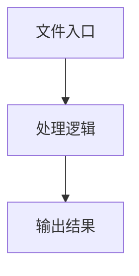

# index.ts

## 0. 文件概述
index.ts - TypeScript/JavaScript 源文件

## 1. 核心功能

### 1.1 导出项
- `export { ContextPreview } from '../context-preview';`
- `export { PlaygroundResultView } from '../playground-result';`
- `export { PromptInput } from '../prompt-input';`
- `export { useServerValid } from '../../hooks/useServerValid';`
- `export { ServiceModeControl } from '../service-mode-control';`
- `export * from '../../types';`
- `export { useEnvConfig } from '../../store/store';`

### 1.2 类定义
- 无类定义

### 1.3 函数定义  
- 无函数定义

### 1.4 常量定义
- 无常量定义

## 2. 逻辑流程

**流程说明**: 该文件实现特定功能，通过导入依赖模块，定义类/函数/常量，并导出供其他模块使用。

## 3. 关键细节

### 3.1 核心变量
- 无核心变量

### 3.2 依赖项
- 无外部依赖

## 4. 跨文件调用关系

### 4.1 该文件调用的其他文件
- 无外部调用

### 4.2 调用该文件的其他文件
该文件通过以下导出项被其他模块使用：
- export { ContextPreview } from '../context-preview';
- export { PlaygroundResultView } from '../playground-result';
- export { PromptInput } from '../prompt-input';
