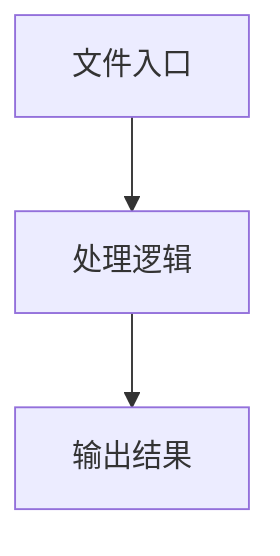

# index.tsx

## 0. 文件概述
index.tsx - TypeScript/JavaScript 源文件

## 1. 核心功能

### 1.1 导出项
- `export const PromptInput: React.FC<PromptInputProps> = ({`

### 1.2 类定义
- 无类定义

### 1.3 函数定义  
- 无函数定义

### 1.4 常量定义
- **PromptInput**: 常量
- **placeholder**: 常量
- **textAreaRef**: 常量
- **modeRadioGroupRef**: 常量
- **params**: 常量
- **lastHistoryRef**: 常量
- **history**: 常量
- **lastSelectedType**: 常量
- **addHistory**: 常量
- **setLastSelectedType**: 常量
- **historyForSelectedType**: 常量
- **needsStructuredParams**: 常量
- **action**: 常量
- **schema**: 常量
- **shape**: 常量
- **shapeKeys**: 常量
- **needsAnyInput**: 常量
- **action**: 常量
- **schema**: 常量
- **shape**: 常量
- **hasRequiredFields**: 常量
- **field**: 常量
- **showDataExtractionOptions**: 常量
- **dataExtractionMethods**: 常量
- **showDeepThinkOption**: 常量
- **action**: 常量
- **schema**: 常量
- **shape**: 常量
- **hasLocateField**: 常量
- **field**: 常量
- **hasConfigOptions**: 常量
- **hasTracking**: 常量
- **hasDeepThink**: 常量
- **hasDataExtraction**: 常量
- **hasDeviceOptions**: 常量
- **availableDropdownMethods**: 常量
- **metadataMethods**: 常量
- **availableMethods**: 常量
- **finalMethods**: 常量
- **methodInfo**: 常量
- **getDefaultParams**: 常量
- **action**: 常量
- **defaultParams**: 常量
- **schema**: 常量
- **shape**: 常量
- **field**: 常量
- **defaultValue**: 常量
- **scrollToSelectedItem**: 常量
- **container**: 常量
- **selectedRadioButton**: 常量
- **dropdownButton**: 常量
- **containerRect**: 常量
- **targetRect**: 常量
- **targetLeft**: 常量
- **targetWidth**: 常量
- **containerWidth**: 常量
- **optimalScrollLeft**: 常量
- **lastHistory**: 常量
- **defaultParams**: 常量
- **timeoutId**: 常量
- **formPromptValue**: 常量
- **handleSelectHistory**: 常量
- **handlePromptChange**: 常量
- **value**: 常量
- **hasSingleStructuredParam**: 常量
- **action**: 常量
- **schema**: 常量
- **shape**: 常量
- **isRunButtonEnabled**: 常量
- **handleRunWithHistory**: 常量
- **values**: 常量
- **action**: 常量
- **otherValues**: 常量
- **schema**: 常量
- **shape**: 常量
- **paramValue**: 常量
- **field**: 常量
- **mainPart**: 常量
- **newHistoryItem**: 常量
- **defaultParams**: 常量
- **handleKeyDown**: 常量
- **textarea**: 常量
- **selectionStart**: 常量
- **value**: 常量
- **lastNewlineIndex**: 常量
- **isAtLastLine**: 常量
- **handleStructuredKeyDown**: 常量
- **renderStructuredParams**: 常量
- **action**: 常量
- **schema**: 常量
- **shape**: 常量
- **schemaKeys**: 常量
- **key**: 常量
- **field**: 常量
- **isLocateFieldFlag**: 常量
- **placeholderText**: 常量
- **fieldWithRuntime**: 常量
- **action**: 常量
- **shape**: 常量
- **fieldDef**: 常量
- **fields**: 常量
- **sortedKeys**: 常量
- **fieldSchemaA**: 常量
- **fieldSchemaB**: 常量
- **fieldSchema**: 常量
- **isLocateFieldFlag**: 常量
- **label**: 常量
- **isRequired**: 常量
- **marginBottom**: 常量
- **placeholder**: 常量
- **fieldWithRuntime**: 常量
- **action**: 常量
- **shape**: 常量
- **fieldDef**: 常量
- **fieldProps**: 常量
- **directionField**: 常量
- **distanceField**: 常量
- **otherFields**: 常量
- **handleMouseEnter**: 常量
- **handleMouseLeave**: 常量
- **renderActionButton**: 常量
- **runButton**: 常量
- **hiddenAPIs**: 常量
- **groupedItems**: 常量
- **interactionAPIs**: 常量
- **extractionAPIs**: 常量
- **validationAPIs**: 常量
- **deviceSpecificAPIs**: 常量

## 2. 逻辑流程

**流程说明**: 该文件实现特定功能，通过导入依赖模块，定义类/函数/常量，并导出供其他模块使用。

## 3. 关键细节

### 3.1 核心变量
- **PromptInput**: 定义的常量
- **placeholder**: 定义的常量
- **textAreaRef**: 定义的常量
- **modeRadioGroupRef**: 定义的常量
- **params**: 定义的常量
- **lastHistoryRef**: 定义的常量
- **history**: 定义的常量
- **lastSelectedType**: 定义的常量
- **addHistory**: 定义的常量
- **setLastSelectedType**: 定义的常量
- **historyForSelectedType**: 定义的常量
- **needsStructuredParams**: 定义的常量
- **action**: 定义的常量
- **schema**: 定义的常量
- **shape**: 定义的常量
- **shapeKeys**: 定义的常量
- **needsAnyInput**: 定义的常量
- **action**: 定义的常量
- **schema**: 定义的常量
- **shape**: 定义的常量
- **hasRequiredFields**: 定义的常量
- **field**: 定义的常量
- **showDataExtractionOptions**: 定义的常量
- **dataExtractionMethods**: 定义的常量
- **showDeepThinkOption**: 定义的常量
- **action**: 定义的常量
- **schema**: 定义的常量
- **shape**: 定义的常量
- **hasLocateField**: 定义的常量
- **field**: 定义的常量
- **hasConfigOptions**: 定义的常量
- **hasTracking**: 定义的常量
- **hasDeepThink**: 定义的常量
- **hasDataExtraction**: 定义的常量
- **hasDeviceOptions**: 定义的常量
- **availableDropdownMethods**: 定义的常量
- **metadataMethods**: 定义的常量
- **availableMethods**: 定义的常量
- **finalMethods**: 定义的常量
- **methodInfo**: 定义的常量
- **getDefaultParams**: 定义的常量
- **action**: 定义的常量
- **defaultParams**: 定义的常量
- **schema**: 定义的常量
- **shape**: 定义的常量
- **field**: 定义的常量
- **defaultValue**: 定义的常量
- **scrollToSelectedItem**: 定义的常量
- **container**: 定义的常量
- **selectedRadioButton**: 定义的常量
- **dropdownButton**: 定义的常量
- **containerRect**: 定义的常量
- **targetRect**: 定义的常量
- **targetLeft**: 定义的常量
- **targetWidth**: 定义的常量
- **containerWidth**: 定义的常量
- **optimalScrollLeft**: 定义的常量
- **lastHistory**: 定义的常量
- **defaultParams**: 定义的常量
- **timeoutId**: 定义的常量
- **formPromptValue**: 定义的常量
- **handleSelectHistory**: 定义的常量
- **handlePromptChange**: 定义的常量
- **value**: 定义的常量
- **hasSingleStructuredParam**: 定义的常量
- **action**: 定义的常量
- **schema**: 定义的常量
- **shape**: 定义的常量
- **isRunButtonEnabled**: 定义的常量
- **handleRunWithHistory**: 定义的常量
- **values**: 定义的常量
- **action**: 定义的常量
- **otherValues**: 定义的常量
- **schema**: 定义的常量
- **shape**: 定义的常量
- **paramValue**: 定义的常量
- **field**: 定义的常量
- **mainPart**: 定义的常量
- **newHistoryItem**: 定义的常量
- **defaultParams**: 定义的常量
- **handleKeyDown**: 定义的常量
- **textarea**: 定义的常量
- **selectionStart**: 定义的常量
- **value**: 定义的常量
- **lastNewlineIndex**: 定义的常量
- **isAtLastLine**: 定义的常量
- **handleStructuredKeyDown**: 定义的常量
- **renderStructuredParams**: 定义的常量
- **action**: 定义的常量
- **schema**: 定义的常量
- **shape**: 定义的常量
- **schemaKeys**: 定义的常量
- **key**: 定义的常量
- **field**: 定义的常量
- **isLocateFieldFlag**: 定义的常量
- **placeholderText**: 定义的常量
- **fieldWithRuntime**: 定义的常量
- **action**: 定义的常量
- **shape**: 定义的常量
- **fieldDef**: 定义的常量
- **fields**: 定义的常量
- **sortedKeys**: 定义的常量
- **fieldSchemaA**: 定义的常量
- **fieldSchemaB**: 定义的常量
- **fieldSchema**: 定义的常量
- **isLocateFieldFlag**: 定义的常量
- **label**: 定义的常量
- **isRequired**: 定义的常量
- **marginBottom**: 定义的常量
- **placeholder**: 定义的常量
- **fieldWithRuntime**: 定义的常量
- **action**: 定义的常量
- **shape**: 定义的常量
- **fieldDef**: 定义的常量
- **fieldProps**: 定义的常量
- **directionField**: 定义的常量
- **distanceField**: 定义的常量
- **otherFields**: 定义的常量
- **handleMouseEnter**: 定义的常量
- **handleMouseLeave**: 定义的常量
- **renderActionButton**: 定义的常量
- **runButton**: 定义的常量
- **hiddenAPIs**: 定义的常量
- **groupedItems**: 定义的常量
- **interactionAPIs**: 定义的常量
- **extractionAPIs**: 定义的常量
- **validationAPIs**: 定义的常量
- **deviceSpecificAPIs**: 定义的常量

### 3.2 依赖项
- `import { BorderOutlined, SendOutlined } from '@ant-design/icons';`
- `import './index.less';`
- `import { DownOutlined } from '@ant-design/icons';`
- `import type { z } from '@midscene/core';`
- `import { Button, Dropdown, Form, Input, Radio, Tooltip } from 'antd';`

（共 19 个导入项）

## 4. 跨文件调用关系

### 4.1 该文件调用的其他文件
根据 import 语句，该文件依赖以下模块：
- import { BorderOutlined, SendOutlined } from '@ant-design/icons';
- import './index.less';
- import { DownOutlined } from '@ant-design/icons';

### 4.2 调用该文件的其他文件
该文件通过以下导出项被其他模块使用：
- export const PromptInput: React.FC<PromptInputProps> = ({
