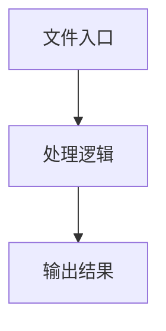

# index.tsx

## 0. 文件概述
index.tsx - TypeScript/JavaScript 源文件

## 1. 核心功能

### 1.1 导出项
- `export default function ScreenshotViewer({`

### 1.2 类定义
- 无类定义

### 1.3 函数定义  
- **ScreenshotViewer()**: 函数
- **to()**: 函数

### 1.4 常量定义
- **pollingIntervalRef**: 常量
- **isPollingPausedRef**: 常量
- **fetchScreenshot**: 常量
- **result**: 常量
- **screenshotData**: 常量
- **fetchInterfaceInfo**: 常量
- **info**: 常量
- **startPolling**: 常量
- **stopPolling**: 常量
- **pausePolling**: 常量
- **resumePolling**: 常量
- **handleManualRefresh**: 常量
- **formatLastUpdateTime**: 常量
- **now**: 常量
- **diff**: 常量

## 2. 逻辑流程

**流程说明**: 该文件实现特定功能，通过导入依赖模块，定义类/函数/常量，并导出供其他模块使用。

## 3. 关键细节

### 3.1 核心变量
- **pollingIntervalRef**: 定义的常量
- **isPollingPausedRef**: 定义的常量
- **fetchScreenshot**: 定义的常量
- **result**: 定义的常量
- **screenshotData**: 定义的常量
- **fetchInterfaceInfo**: 定义的常量
- **info**: 定义的常量
- **startPolling**: 定义的常量
- **stopPolling**: 定义的常量
- **pausePolling**: 定义的常量
- **resumePolling**: 定义的常量
- **handleManualRefresh**: 定义的常量
- **formatLastUpdateTime**: 定义的常量
- **now**: 定义的常量
- **diff**: 定义的常量

### 3.2 依赖项
- `import { InfoCircleOutlined, ReloadOutlined } from '@ant-design/icons';`
- `import { Button, Spin, Tooltip } from 'antd';`
- `import { useCallback, useEffect, useRef, useState } from 'react';`
- `import './index.less';`

## 4. 跨文件调用关系

### 4.1 该文件调用的其他文件
根据 import 语句，该文件依赖以下模块：
- import { InfoCircleOutlined, ReloadOutlined } from '@ant-design/icons';
- import { Button, Spin, Tooltip } from 'antd';
- import { useCallback, useEffect, useRef, useState } from 'react';

### 4.2 调用该文件的其他文件
该文件通过以下导出项被其他模块使用：
- export default function ScreenshotViewer({
