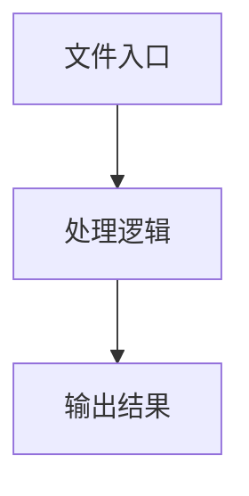

# index.tsx

## 0. 文件概述
index.tsx - TypeScript/JavaScript 源文件

## 1. 核心功能

### 1.1 导出项
- `export function UniversalPlayground({`
- `export default UniversalPlayground;`

### 1.2 类定义
- 无类定义

### 1.3 函数定义  
- **getSDKId()**: 函数
- **ErrorMessage()**: 函数
- **UniversalPlayground()**: 函数

### 1.4 常量定义
- **cleanError**: 常量
- **initializeSDK**: 常量
- **effectiveStorage**: 常量
- **namespace**: 常量
- **bestStorageType**: 常量
- **handleFormRun**: 常量
- **value**: 常量
- **configAlreadySet**: 常量
- **runButtonEnabled**: 常量
- **selectedType**: 常量
- **serviceMode**: 常量
- **finalShowContextPreview**: 常量
- **layout**: 常量
- **showVersionInfo**: 常量
- **deviceType**: 常量
- **parts**: 常量
- **action**: 常量
- **description**: 常量
- **currentIndex**: 常量
- **laterProgressExists**: 常量
- **isLatestProgress**: 常量
- **shouldShowLoading**: 常量

## 2. 逻辑流程

**流程说明**: 该文件实现特定功能，通过导入依赖模块，定义类/函数/常量，并导出供其他模块使用。

## 3. 关键细节

### 3.1 核心变量
- **cleanError**: 定义的常量
- **initializeSDK**: 定义的常量
- **effectiveStorage**: 定义的常量
- **namespace**: 定义的常量
- **bestStorageType**: 定义的常量
- **handleFormRun**: 定义的常量
- **value**: 定义的常量
- **configAlreadySet**: 定义的常量
- **runButtonEnabled**: 定义的常量
- **selectedType**: 定义的常量
- **serviceMode**: 定义的常量
- **finalShowContextPreview**: 定义的常量
- **layout**: 定义的常量
- **showVersionInfo**: 定义的常量
- **deviceType**: 定义的常量
- **parts**: 定义的常量
- **action**: 定义的常量
- **description**: 定义的常量
- **currentIndex**: 定义的常量
- **laterProgressExists**: 定义的常量
- **isLatestProgress**: 定义的常量
- **shouldShowLoading**: 定义的常量

### 3.2 依赖项
- `import Icon, {`
- `import { Alert, Button, Form, List, Typography, message } from 'antd';`
- `import { useCallback, useEffect, useMemo, useState } from 'react';`
- `import { usePlaygroundExecution } from '../../hooks/usePlaygroundExecution';`
- `import { usePlaygroundState } from '../../hooks/usePlaygroundState';`

（共 16 个导入项）

## 4. 跨文件调用关系

### 4.1 该文件调用的其他文件
根据 import 语句，该文件依赖以下模块：
- import Icon, {
- import { Alert, Button, Form, List, Typography, message } from 'antd';
- import { useCallback, useEffect, useMemo, useState } from 'react';

### 4.2 调用该文件的其他文件
该文件通过以下导出项被其他模块使用：
- export function UniversalPlayground({
- export default UniversalPlayground;
