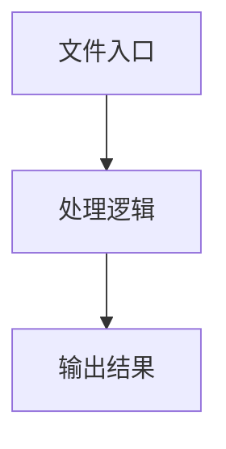

# indexeddb-storage-provider.ts

## 0. 文件概述
indexeddb-storage-provider.ts - TypeScript/JavaScript 源文件

## 1. 核心功能

### 1.1 导出项
- `export class IndexedDBStorageProvider implements StorageProvider {`
- `export class MemoryStorageProvider implements StorageProvider {`
- `export class NoOpStorageProvider implements StorageProvider {`

### 1.2 类定义
- **IndexedDBStorageProvider**: 类定义
- **MemoryStorageProvider**: 类定义
- **NoOpStorageProvider**: 类定义

### 1.3 函数定义  
- 无函数定义

### 1.4 常量定义
- **DB_NAME**: 常量
- **DB_VERSION**: 常量
- **MESSAGES_STORE**: 常量
- **RESULTS_STORE**: 常量
- **MAX_STORED_MESSAGES**: 常量
- **MAX_STORED_RESULTS**: 常量
- **messagesToSave**: 常量
- **lightMessage**: 常量
- **data**: 常量
- **result**: 常量
- **messages**: 常量
- **item**: 常量
- **restoredItem**: 常量
- **fullResult**: 常量
- **compressedResult**: 常量
- **data**: 常量
- **result**: 常量
- **data**: 常量
- **compressedTasks**: 常量
- **sizeKB**: 常量
- **result**: 常量

## 2. 逻辑流程

**流程说明**: 该文件实现特定功能，通过导入依赖模块，定义类/函数/常量，并导出供其他模块使用。

## 3. 关键细节

### 3.1 核心变量
- **DB_NAME**: 定义的常量
- **DB_VERSION**: 定义的常量
- **MESSAGES_STORE**: 定义的常量
- **RESULTS_STORE**: 定义的常量
- **MAX_STORED_MESSAGES**: 定义的常量
- **MAX_STORED_RESULTS**: 定义的常量
- **messagesToSave**: 定义的常量
- **lightMessage**: 定义的常量
- **data**: 定义的常量
- **result**: 定义的常量
- **messages**: 定义的常量
- **item**: 定义的常量
- **restoredItem**: 定义的常量
- **fullResult**: 定义的常量
- **compressedResult**: 定义的常量
- **data**: 定义的常量
- **result**: 定义的常量
- **data**: 定义的常量
- **compressedTasks**: 定义的常量
- **sizeKB**: 定义的常量
- **result**: 定义的常量

### 3.2 依赖项
- `import {`
- `import type { InfoListItem, StorageProvider } from '../../../types';`

## 4. 跨文件调用关系

### 4.1 该文件调用的其他文件
根据 import 语句，该文件依赖以下模块：
- import {
- import type { InfoListItem, StorageProvider } from '../../../types';

### 4.2 调用该文件的其他文件
该文件通过以下导出项被其他模块使用：
- export class IndexedDBStorageProvider implements StorageProvider {
- export class MemoryStorageProvider implements StorageProvider {
- export class NoOpStorageProvider implements StorageProvider {
