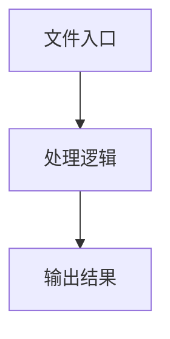

# storage-provider.ts

## 0. 文件概述
storage-provider.ts - TypeScript/JavaScript 源文件

## 1. 核心功能

### 1.1 导出项
- `export class LocalStorageProvider implements StorageProvider {`
- `export class MemoryStorageProvider implements StorageProvider {`
- `export class NoOpStorageProvider implements StorageProvider {`
- `export enum StorageType {`
- `export function createStorageProvider(`
- `export function detectBestStorageType(): StorageType {`
- `export {`

### 1.2 类定义
- **LocalStorageProvider**: 类定义
- **MemoryStorageProvider**: 类定义
- **NoOpStorageProvider**: 类定义

### 1.3 函数定义  
- **to()**: 函数
- **createStorageProvider()**: 函数
- **to()**: 函数
- **detectBestStorageType()**: 函数

### 1.4 常量定义
- **testKey**: 常量
- **testData**: 常量
- **messagesToSave**: 常量
- **lightMessages**: 常量
- **messageData**: 常量
- **recentMessages**: 常量
- **lightRecentMessages**: 常量
- **messageData**: 常量
- **stored**: 常量
- **messages**: 常量
- **restoredMessages**: 常量
- **resultKey**: 常量
- **storedResult**: 常量
- **resultItem**: 常量
- **keys**: 常量
- **resultKey**: 常量
- **resultKey**: 常量
- **keys**: 常量
- **resultKeys**: 常量
- **keysToRemove**: 常量
- **playgroundKeys**: 常量
- **additionalKeysToRemove**: 常量

## 2. 逻辑流程

**流程说明**: 该文件实现特定功能，通过导入依赖模块，定义类/函数/常量，并导出供其他模块使用。

## 3. 关键细节

### 3.1 核心变量
- **testKey**: 定义的常量
- **testData**: 定义的常量
- **messagesToSave**: 定义的常量
- **lightMessages**: 定义的常量
- **messageData**: 定义的常量
- **recentMessages**: 定义的常量
- **lightRecentMessages**: 定义的常量
- **messageData**: 定义的常量
- **stored**: 定义的常量
- **messages**: 定义的常量
- **restoredMessages**: 定义的常量
- **resultKey**: 定义的常量
- **storedResult**: 定义的常量
- **resultItem**: 定义的常量
- **keys**: 定义的常量
- **resultKey**: 定义的常量
- **resultKey**: 定义的常量
- **keys**: 定义的常量
- **resultKeys**: 定义的常量
- **keysToRemove**: 定义的常量
- **playgroundKeys**: 定义的常量
- **additionalKeysToRemove**: 定义的常量

### 3.2 依赖项
- `import type { InfoListItem, StorageProvider } from '../../../types';`
- `import {`

## 4. 跨文件调用关系

### 4.1 该文件调用的其他文件
根据 import 语句，该文件依赖以下模块：
- import type { InfoListItem, StorageProvider } from '../../../types';
- import {

### 4.2 调用该文件的其他文件
该文件通过以下导出项被其他模块使用：
- export class LocalStorageProvider implements StorageProvider {
- export class MemoryStorageProvider implements StorageProvider {
- export class NoOpStorageProvider implements StorageProvider {
