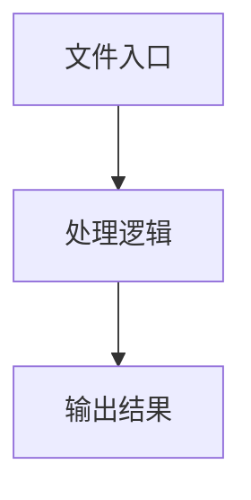

# usePlaygroundExecution.ts

## 0. 文件概述
usePlaygroundExecution.ts - TypeScript/JavaScript 源文件

## 1. 核心功能

### 1.1 导出项
- `export function usePlaygroundExecution(`

### 1.2 类定义
- 无类定义

### 1.3 函数定义  
- **formatError()**: 函数
- **buildProgressContent()**: 函数
- **wrapExecutionDumpForReplay()**: 函数
- **usePlaygroundExecution()**: 函数

### 1.4 常量定义
- **action**: 常量
- **description**: 常量
- **modelBriefsSet**: 常量
- **modelBriefs**: 常量
- **handleRun**: 常量
- **thisRunningId**: 常量
- **actionType**: 常量
- **displayContent**: 常量
- **userItem**: 常量
- **result**: 常量
- **systemItem**: 常量
- **progressItems**: 常量
- **systemItemIndex**: 常量
- **listWithoutCurrentProgress**: 常量
- **resultObj**: 常量
- **groupedDump**: 常量
- **info**: 常量
- **resultItem**: 常量
- **separatorItem**: 常量
- **handleStop**: 常量
- **thisRunningId**: 常量
- **cancelResult**: 常量
- **resultItem**: 常量
- **stopItem**: 常量
- **separatorItem**: 常量
- **canStop**: 常量

## 2. 逻辑流程

**流程说明**: 该文件实现特定功能，通过导入依赖模块，定义类/函数/常量，并导出供其他模块使用。

## 3. 关键细节

### 3.1 核心变量
- **action**: 定义的常量
- **description**: 定义的常量
- **modelBriefsSet**: 定义的常量
- **modelBriefs**: 定义的常量
- **handleRun**: 定义的常量
- **thisRunningId**: 定义的常量
- **actionType**: 定义的常量
- **displayContent**: 定义的常量
- **userItem**: 定义的常量
- **result**: 定义的常量
- **systemItem**: 定义的常量
- **progressItems**: 定义的常量
- **systemItemIndex**: 定义的常量
- **listWithoutCurrentProgress**: 定义的常量
- **resultObj**: 定义的常量
- **groupedDump**: 定义的常量
- **info**: 定义的常量
- **resultItem**: 定义的常量
- **separatorItem**: 定义的常量
- **handleStop**: 定义的常量
- **thisRunningId**: 定义的常量
- **cancelResult**: 定义的常量
- **resultItem**: 定义的常量
- **stopItem**: 定义的常量
- **separatorItem**: 定义的常量
- **canStop**: 定义的常量

### 3.2 依赖项
- `import type { DeviceAction, ExecutionDump } from '@midscene/core';`
- `import { paramStr, typeStr } from '@midscene/core/agent';`
- `import { useCallback } from 'react';`
- `import { useEnvConfig } from '../store/store';`
- `import type {`

（共 7 个导入项）

## 4. 跨文件调用关系

### 4.1 该文件调用的其他文件
根据 import 语句，该文件依赖以下模块：
- import type { DeviceAction, ExecutionDump } from '@midscene/core';
- import { paramStr, typeStr } from '@midscene/core/agent';
- import { useCallback } from 'react';

### 4.2 调用该文件的其他文件
该文件通过以下导出项被其他模块使用：
- export function usePlaygroundExecution(
