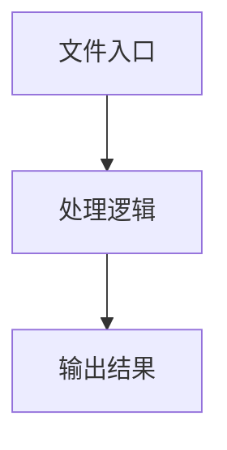

# usePlaygroundState.ts

## 0. 文件概述
usePlaygroundState.ts - TypeScript/JavaScript 源文件

## 1. 核心功能

### 1.1 导出项
- `export function usePlaygroundState(`

### 1.2 类定义
- 无类定义

### 1.3 函数定义  
- **usePlaygroundState()**: 函数

### 1.4 常量定义
- **infoListRef**: 常量
- **currentRunningIdRef**: 常量
- **interruptedFlagRef**: 常量
- **initializedRef**: 常量
- **migrateFromOldNamespace**: 常量
- **oldStorage**: 常量
- **oldMessages**: 常量
- **initializeMessages**: 常量
- **welcomeMessage**: 常量
- **hasWelcomeMessage**: 常量
- **loadActionSpace**: 常量
- **context**: 常量
- **space**: 常量
- **sizeThreshold**: 常量
- **handleResize**: 常量
- **scrollToBottom**: 常量
- **checkIfScrolledToBottom**: 常量
- **isAtBottom**: 常量
- **handleScrollToBottom**: 常量
- **container**: 常量
- **clearInfoList**: 常量
- **welcomeMessage**: 常量
- **refreshContext**: 常量
- **newContext**: 常量

## 2. 逻辑流程

**流程说明**: 该文件实现特定功能，通过导入依赖模块，定义类/函数/常量，并导出供其他模块使用。

## 3. 关键细节

### 3.1 核心变量
- **infoListRef**: 定义的常量
- **currentRunningIdRef**: 定义的常量
- **interruptedFlagRef**: 定义的常量
- **initializedRef**: 定义的常量
- **migrateFromOldNamespace**: 定义的常量
- **oldStorage**: 定义的常量
- **oldMessages**: 定义的常量
- **initializeMessages**: 定义的常量
- **welcomeMessage**: 定义的常量
- **hasWelcomeMessage**: 定义的常量
- **loadActionSpace**: 定义的常量
- **context**: 定义的常量
- **space**: 定义的常量
- **sizeThreshold**: 定义的常量
- **handleResize**: 定义的常量
- **scrollToBottom**: 定义的常量
- **checkIfScrolledToBottom**: 定义的常量
- **isAtBottom**: 定义的常量
- **handleScrollToBottom**: 定义的常量
- **container**: 定义的常量
- **clearInfoList**: 定义的常量
- **welcomeMessage**: 定义的常量
- **refreshContext**: 定义的常量
- **newContext**: 定义的常量

### 3.2 依赖项
- `import type { DeviceAction, UIContext } from '@midscene/core';`
- `import { useCallback, useEffect, useRef, useState } from 'react';`
- `import {`
- `import type {`
- `import { WELCOME_MESSAGE_TEMPLATE } from '../utils/constants';`

## 4. 跨文件调用关系

### 4.1 该文件调用的其他文件
根据 import 语句，该文件依赖以下模块：
- import type { DeviceAction, UIContext } from '@midscene/core';
- import { useCallback, useEffect, useRef, useState } from 'react';
- import {

### 4.2 调用该文件的其他文件
该文件通过以下导出项被其他模块使用：
- export function usePlaygroundState(
