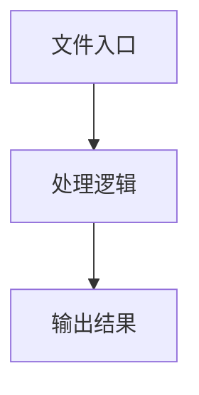

# history.ts

## 0. 文件概述
history.ts - TypeScript/JavaScript 源文件

## 1. 核心功能

### 1.1 导出项
- `export interface HistoryItem {`
- `export type HistoryState = Record<string, HistoryItem[]>;`
- `export const useHistoryStore = create<{`

### 1.2 类定义
- 无类定义

### 1.3 函数定义  
- 无函数定义

### 1.4 常量定义
- **HISTORY_KEY**: 常量
- **LAST_SELECTED_TYPE_KEY**: 常量
- **getHistoryFromLocalStorage**: 常量
- **historyString**: 常量
- **getLastSelectedType**: 常量
- **setLastSelectedType**: 常量
- **useHistoryStore**: 常量
- **newHistory**: 常量
- **currentHistory**: 常量
- **typeHistory**: 常量
- **stringifiedNewItem**: 常量
- **newTypeHistory**: 常量
- **stringifiedOldItem**: 常量
- **newHistory**: 常量

## 2. 逻辑流程

**流程说明**: 该文件实现特定功能，通过导入依赖模块，定义类/函数/常量，并导出供其他模块使用。

## 3. 关键细节

### 3.1 核心变量
- **HISTORY_KEY**: 定义的常量
- **LAST_SELECTED_TYPE_KEY**: 定义的常量
- **getHistoryFromLocalStorage**: 定义的常量
- **historyString**: 定义的常量
- **getLastSelectedType**: 定义的常量
- **setLastSelectedType**: 定义的常量
- **useHistoryStore**: 定义的常量
- **newHistory**: 定义的常量
- **currentHistory**: 定义的常量
- **typeHistory**: 定义的常量
- **stringifiedNewItem**: 定义的常量
- **newTypeHistory**: 定义的常量
- **stringifiedOldItem**: 定义的常量
- **newHistory**: 定义的常量

### 3.2 依赖项
- `import * as Z from 'zustand';`

## 4. 跨文件调用关系

### 4.1 该文件调用的其他文件
根据 import 语句，该文件依赖以下模块：
- import * as Z from 'zustand';

### 4.2 调用该文件的其他文件
该文件通过以下导出项被其他模块使用：
- export interface HistoryItem {
- export type HistoryState = Record<string, HistoryItem[]>;
- export const useHistoryStore = create<{
