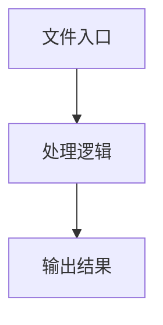

# store.tsx

## 0. 文件概述
store.tsx - TypeScript/JavaScript 源文件

## 1. 核心功能

### 1.1 导出项
- `export const useGlobalPreference = create<{`
- `export type ServiceModeType = 'Server' | 'In-Browser' | 'In-Browser-Extension'; // | 'Extension';`
- `export type ImeStrategyType = 'always-yadb' | 'yadb-for-non-ascii';`
- `export type KeyboardDismissStrategyType = 'esc-first' | 'back-first';`
- `export const useEnvConfig = create<{`

### 1.2 类定义
- 无类定义

### 1.3 函数定义  
- 无函数定义

### 1.4 常量定义
- **AUTO_ZOOM_KEY**: 常量
- **BACKGROUND_VISIBLE_KEY**: 常量
- **ELEMENTS_VISIBLE_KEY**: 常量
- **MODEL_CALL_DETAILS_KEY**: 常量
- **DARK_MODE_KEY**: 常量
- **parseBooleanParam**: 常量
- **normalized**: 常量
- **getQueryPreference**: 常量
- **searchParams**: 常量
- **useGlobalPreference**: 常量
- **savedAutoZoom**: 常量
- **savedBackgroundVisible**: 常量
- **savedElementsVisible**: 常量
- **savedModelCallDetails**: 常量
- **savedDarkMode**: 常量
- **autoZoomFromQuery**: 常量
- **elementsVisibleFromQuery**: 常量
- **darkModeFromQuery**: 常量
- **initialDarkMode**: 常量
- **CONFIG_KEY**: 常量
- **SERVICE_MODE_KEY**: 常量
- **TRACKING_ACTIVE_TAB_KEY**: 常量
- **DEEP_THINK_KEY**: 常量
- **SCREENSHOT_INCLUDED_KEY**: 常量
- **DOM_INCLUDED_KEY**: 常量
- **IME_STRATEGY_KEY**: 常量
- **AUTO_DISMISS_KEYBOARD_KEY**: 常量
- **KEYBOARD_DISMISS_STRATEGY_KEY**: 常量
- **ALWAYS_REFRESH_SCREEN_INFO_KEY**: 常量
- **getConfigStringFromLocalStorage**: 常量
- **configString**: 常量
- **parseConfig**: 常量
- **lines**: 常量
- **config**: 常量
- **trimmed**: 常量
- **cleanLine**: 常量
- **match**: 常量
- **useEnvConfig**: 常量
- **configString**: 常量
- **config**: 常量
- **ifInExtension**: 常量
- **savedServiceMode**: 常量
- **savedForceSameTabNavigation**: 常量
- **savedDeepThink**: 常量
- **savedScreenshotIncluded**: 常量
- **savedDomIncluded**: 常量
- **savedImeStrategy**: 常量
- **savedAutoDismissKeyboard**: 常量
- **savedKeyboardDismissStrategy**: 常量
- **savedAlwaysRefreshScreenInfo**: 常量
- **config**: 常量
- **latestConfigString**: 常量
- **latestConfig**: 常量

## 2. 逻辑流程

**流程说明**: 该文件实现特定功能，通过导入依赖模块，定义类/函数/常量，并导出供其他模块使用。

## 3. 关键细节

### 3.1 核心变量
- **AUTO_ZOOM_KEY**: 定义的常量
- **BACKGROUND_VISIBLE_KEY**: 定义的常量
- **ELEMENTS_VISIBLE_KEY**: 定义的常量
- **MODEL_CALL_DETAILS_KEY**: 定义的常量
- **DARK_MODE_KEY**: 定义的常量
- **parseBooleanParam**: 定义的常量
- **normalized**: 定义的常量
- **getQueryPreference**: 定义的常量
- **searchParams**: 定义的常量
- **useGlobalPreference**: 定义的常量
- **savedAutoZoom**: 定义的常量
- **savedBackgroundVisible**: 定义的常量
- **savedElementsVisible**: 定义的常量
- **savedModelCallDetails**: 定义的常量
- **savedDarkMode**: 定义的常量
- **autoZoomFromQuery**: 定义的常量
- **elementsVisibleFromQuery**: 定义的常量
- **darkModeFromQuery**: 定义的常量
- **initialDarkMode**: 定义的常量
- **CONFIG_KEY**: 定义的常量
- **SERVICE_MODE_KEY**: 定义的常量
- **TRACKING_ACTIVE_TAB_KEY**: 定义的常量
- **DEEP_THINK_KEY**: 定义的常量
- **SCREENSHOT_INCLUDED_KEY**: 定义的常量
- **DOM_INCLUDED_KEY**: 定义的常量
- **IME_STRATEGY_KEY**: 定义的常量
- **AUTO_DISMISS_KEYBOARD_KEY**: 定义的常量
- **KEYBOARD_DISMISS_STRATEGY_KEY**: 定义的常量
- **ALWAYS_REFRESH_SCREEN_INFO_KEY**: 定义的常量
- **getConfigStringFromLocalStorage**: 定义的常量
- **configString**: 定义的常量
- **parseConfig**: 定义的常量
- **lines**: 定义的常量
- **config**: 定义的常量
- **trimmed**: 定义的常量
- **cleanLine**: 定义的常量
- **match**: 定义的常量
- **useEnvConfig**: 定义的常量
- **configString**: 定义的常量
- **config**: 定义的常量
- **ifInExtension**: 定义的常量
- **savedServiceMode**: 定义的常量
- **savedForceSameTabNavigation**: 定义的常量
- **savedDeepThink**: 定义的常量
- **savedScreenshotIncluded**: 定义的常量
- **savedDomIncluded**: 定义的常量
- **savedImeStrategy**: 定义的常量
- **savedAutoDismissKeyboard**: 定义的常量
- **savedKeyboardDismissStrategy**: 定义的常量
- **savedAlwaysRefreshScreenInfo**: 定义的常量
- **config**: 定义的常量
- **latestConfigString**: 定义的常量
- **latestConfig**: 定义的常量

### 3.2 依赖项
- `import * as Z from 'zustand';`

## 4. 跨文件调用关系

### 4.1 该文件调用的其他文件
根据 import 语句，该文件依赖以下模块：
- import * as Z from 'zustand';

### 4.2 调用该文件的其他文件
该文件通过以下导出项被其他模块使用：
- export const useGlobalPreference = create<{
- export type ServiceModeType = 'Server' | 'In-Browser' | 'In-Browser-Extension'; // | 'Extension';
- export type ImeStrategyType = 'always-yadb' | 'yadb-for-non-ascii';
