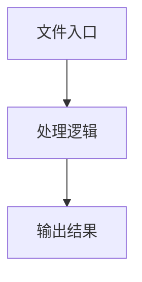

# types.ts

## 0. 文件概述
types.ts - TypeScript/JavaScript 源文件

## 1. 核心功能

### 1.1 导出项
- `export interface ZodType {`
- `export interface ZodObjectSchema extends ZodType {`
- `export interface ZodEnumSchema extends ZodType {`
- `export interface ZodNumberSchema extends ZodType {`
- `export interface ZodBooleanSchema extends ZodType {`
- `export interface ZodRuntimeAccess extends ZodType {`
- `export interface ActionSpaceItem`
- `export interface FormParams {`
- `export const VALIDATION_CONSTANTS = {`
- `export const isZodObjectSchema = (`
- `export const isLocateField = (field: ZodType): boolean => {`
- `export const unwrapZodType = (`
- `export const extractDefaultValue = (field: ZodType): unknown => {`
- `export interface PlaygroundResult {`
- `export interface PlaygroundProps {`
- `export interface StaticPlaygroundProps {`
- `export type ServiceModeType = 'Server' | 'In-Browser' | 'In-Browser-Extension';`
- `export type DeviceType = 'web' | 'android' | 'ios';`
- `export type RunType =`
- `export interface ReplayScriptsInfo {`
- `export interface FormValue {`
- `export type { ExecutionOptions };`
- `export type ProgressCallback = (`
- `export interface PlaygroundSDKLike {`
- `export interface StorageProvider {`
- `export interface ContextProvider {`
- `export interface InfoListItem {`
- `export interface UniversalPlaygroundConfig {`
- `export interface PlaygroundBranding {`
- `export interface UniversalPlaygroundProps {`

### 1.2 类定义
- 无类定义

### 1.3 函数定义  
- **to()**: 函数

### 1.4 常量定义
- **VALIDATION_CONSTANTS**: 常量
- **isZodObjectSchema**: 常量
- **isLocateField**: 常量
- **fieldWithRuntime**: 常量
- **description**: 常量
- **description**: 常量
- **desc**: 常量
- **unwrapZodType**: 常量
- **extractDefaultValue**: 常量

## 2. 逻辑流程

**流程说明**: 该文件实现特定功能，通过导入依赖模块，定义类/函数/常量，并导出供其他模块使用。

## 3. 关键细节

### 3.1 核心变量
- **VALIDATION_CONSTANTS**: 定义的常量
- **isZodObjectSchema**: 定义的常量
- **isLocateField**: 定义的常量
- **fieldWithRuntime**: 定义的常量
- **description**: 定义的常量
- **description**: 定义的常量
- **desc**: 定义的常量
- **unwrapZodType**: 定义的常量
- **extractDefaultValue**: 定义的常量

### 3.2 依赖项
- `import type { DeviceAction, UIContext } from '@midscene/core';`
- `import type { ComponentType } from 'react';`
- `import type {`
- `import type { ExecutionOptions, PlaygroundAgent } from '@midscene/playground';`

## 4. 跨文件调用关系

### 4.1 该文件调用的其他文件
根据 import 语句，该文件依赖以下模块：
- import type { DeviceAction, UIContext } from '@midscene/core';
- import type { ComponentType } from 'react';
- import type {

### 4.2 调用该文件的其他文件
该文件通过以下导出项被其他模块使用：
- export interface ZodType {
- export interface ZodObjectSchema extends ZodType {
- export interface ZodEnumSchema extends ZodType {
