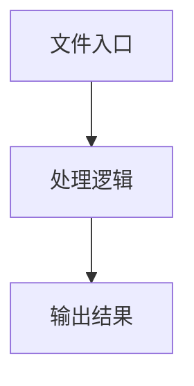

# constants.tsx

## 0. 文件概述
constants.tsx - TypeScript/JavaScript 源文件

## 1. 核心功能

### 1.1 导出项
- `export const trackingTip = 'limit popup to current tab';`
- `export const deepThinkTip = 'deep think';`
- `export const screenshotIncludedTip = 'include screenshot in request';`
- `export const domIncludedTip = 'include DOM info in request';`
- `export const imeStrategyTip = 'IME strategy';`
- `export const autoDismissKeyboardTip = 'Auto dismiss keyboard';`
- `export const keyboardDismissStrategyTip = 'Keyboard dismiss strategy';`
- `export const alwaysRefreshScreenInfoTip = 'Always refresh screen info';`
- `export const apiMetadata = {`
- `export const defaultMainButtons = ['aiAct', 'aiTap', 'aiQuery', 'aiAssert'];`
- `export const WELCOME_MESSAGE_TEMPLATE: Omit<InfoListItem, 'id' | 'timestamp'> =`
- `export const BLANK_RESULT: PlaygroundResult = {`

### 1.2 类定义
- 无类定义

### 1.3 函数定义  
- 无函数定义

### 1.4 常量定义
- **trackingTip**: 常量
- **deepThinkTip**: 常量
- **screenshotIncludedTip**: 常量
- **domIncludedTip**: 常量
- **imeStrategyTip**: 常量
- **autoDismissKeyboardTip**: 常量
- **keyboardDismissStrategyTip**: 常量
- **alwaysRefreshScreenInfoTip**: 常量
- **apiMetadata**: 常量
- **defaultMainButtons**: 常量
- **WELCOME_MESSAGE_TEMPLATE**: 常量
- **BLANK_RESULT**: 常量

## 2. 逻辑流程

**流程说明**: 该文件实现特定功能，通过导入依赖模块，定义类/函数/常量，并导出供其他模块使用。

## 3. 关键细节

### 3.1 核心变量
- **trackingTip**: 定义的常量
- **deepThinkTip**: 定义的常量
- **screenshotIncludedTip**: 定义的常量
- **domIncludedTip**: 定义的常量
- **imeStrategyTip**: 定义的常量
- **autoDismissKeyboardTip**: 定义的常量
- **keyboardDismissStrategyTip**: 定义的常量
- **alwaysRefreshScreenInfoTip**: 定义的常量
- **apiMetadata**: 定义的常量
- **defaultMainButtons**: 定义的常量
- **WELCOME_MESSAGE_TEMPLATE**: 定义的常量
- **BLANK_RESULT**: 定义的常量

### 3.2 依赖项
- `import type { InfoListItem, PlaygroundResult } from '../types';`

## 4. 跨文件调用关系

### 4.1 该文件调用的其他文件
根据 import 语句，该文件依赖以下模块：
- import type { InfoListItem, PlaygroundResult } from '../types';

### 4.2 调用该文件的其他文件
该文件通过以下导出项被其他模块使用：
- export const trackingTip = 'limit popup to current tab';
- export const deepThinkTip = 'deep think';
- export const screenshotIncludedTip = 'include screenshot in request';
