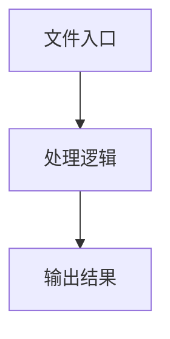

# pixi-loader.ts

## 0. 文件概述
pixi-loader.ts - TypeScript/JavaScript 源文件

## 1. 核心功能

### 1.1 导出项
- `export const loadTexture = async (img: string) => {`
- `export const getTextureFromCache = (name: string) => {`
- `export const getTexture = async (name: string) => {`

### 1.2 类定义
- 无类定义

### 1.3 函数定义  
- 无函数定义

### 1.4 常量定义
- **globalTextureMap**: 常量
- **loadTexture**: 常量
- **getTextureFromCache**: 常量
- **getTexture**: 常量

## 2. 逻辑流程

**流程说明**: 该文件实现特定功能，通过导入依赖模块，定义类/函数/常量，并导出供其他模块使用。

## 3. 关键细节

### 3.1 核心变量
- **globalTextureMap**: 定义的常量
- **loadTexture**: 定义的常量
- **getTextureFromCache**: 定义的常量
- **getTexture**: 定义的常量

### 3.2 依赖项
- `import 'pixi.js/unsafe-eval';`
- `import * as PIXI from 'pixi.js';`

## 4. 跨文件调用关系

### 4.1 该文件调用的其他文件
根据 import 语句，该文件依赖以下模块：
- import 'pixi.js/unsafe-eval';
- import * as PIXI from 'pixi.js';

### 4.2 调用该文件的其他文件
该文件通过以下导出项被其他模块使用：
- export const loadTexture = async (img: string) => {
- export const getTextureFromCache = (name: string) => {
- export const getTexture = async (name: string) => {
