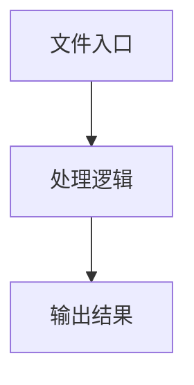

# playground-utils.ts

## 0. 文件概述
playground-utils.ts - TypeScript/JavaScript 源文件

## 1. 核心功能

### 1.1 导出项
- `export const actionNameForType = (type: string) => {`
- `export const staticAgentFromContext = (context: WebUIContext) => {`
- `export const getPlaceholderForType = (type: string): string => {`
- `export const isRunButtonEnabled = (`

### 1.2 类定义
- 无类定义

### 1.3 函数定义  
- 无函数定义

### 1.4 常量定义
- **actionNameForType**: 常量
- **typeWithoutAi**: 常量
- **fullName**: 常量
- **words**: 常量
- **staticAgentFromContext**: 常量
- **page**: 常量
- **getPlaceholderForType**: 常量
- **isRunButtonEnabled**: 常量
- **needsAnyInput**: 常量
- **action**: 常量
- **shape**: 常量
- **shapeKeys**: 常量
- **currentParams**: 常量
- **action**: 常量
- **schema**: 常量
- **shape**: 常量
- **field**: 常量
- **value**: 常量

## 2. 逻辑流程

**流程说明**: 该文件实现特定功能，通过导入依赖模块，定义类/函数/常量，并导出供其他模块使用。

## 3. 关键细节

### 3.1 核心变量
- **actionNameForType**: 定义的常量
- **typeWithoutAi**: 定义的常量
- **fullName**: 定义的常量
- **words**: 定义的常量
- **staticAgentFromContext**: 定义的常量
- **page**: 定义的常量
- **getPlaceholderForType**: 定义的常量
- **isRunButtonEnabled**: 定义的常量
- **needsAnyInput**: 定义的常量
- **action**: 定义的常量
- **shape**: 定义的常量
- **shapeKeys**: 定义的常量
- **currentParams**: 定义的常量
- **action**: 定义的常量
- **schema**: 定义的常量
- **shape**: 定义的常量
- **field**: 定义的常量
- **value**: 定义的常量

### 3.2 依赖项
- `import type { WebUIContext } from '@midscene/core';`
- `import { StaticPage, StaticPageAgent } from '@midscene/web/static';`
- `import type { ZodObjectSchema } from '../types';`
- `import { isZodObjectSchema, unwrapZodType } from '../types';`

## 4. 跨文件调用关系

### 4.1 该文件调用的其他文件
根据 import 语句，该文件依赖以下模块：
- import type { WebUIContext } from '@midscene/core';
- import { StaticPage, StaticPageAgent } from '@midscene/web/static';
- import type { ZodObjectSchema } from '../types';

### 4.2 调用该文件的其他文件
该文件通过以下导出项被其他模块使用：
- export const actionNameForType = (type: string) => {
- export const staticAgentFromContext = (context: WebUIContext) => {
- export const getPlaceholderForType = (type: string): string => {
