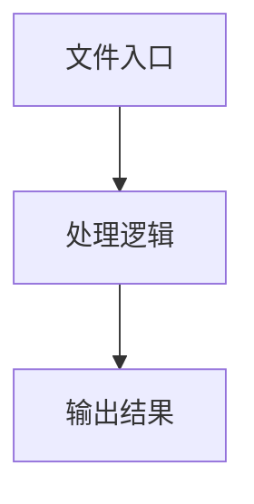

# replay-scripts.ts

## 0. 文件概述
replay-scripts.ts - TypeScript/JavaScript 源文件

## 1. 核心功能

### 1.1 导出项
- `export interface CameraState {`
- `export type TargetCameraState = Omit<`
- `export interface AnimationScript {`
- `export const cameraStateForRect = (`
- `export const mergeTwoCameraState = (`
- `export interface ReplayScriptsInfo {`
- `export const allScriptsFromDump = (`
- `export const generateAnimationScripts = (`

### 1.2 类定义
- 无类定义

### 1.3 函数定义  
- 无函数定义

### 1.4 常量定义
- **stillDuration**: 常量
- **actionSpinningPointerDuration**: 常量
- **stillAfterInsightDuration**: 常量
- **locateDuration**: 常量
- **actionDuration**: 常量
- **clearInsightDuration**: 常量
- **lastFrameDuration**: 常量
- **cameraStateForRect**: 常量
- **canvasRatio**: 常量
- **rectRatio**: 常量
- **cameraPaddingRatio**: 常量
- **cameraWidth**: 常量
- **cameraHeight**: 常量
- **mergeTwoCameraState**: 常量
- **newLeft**: 常量
- **newTop**: 常量
- **newRight**: 常量
- **newWidth**: 常量
- **capitalizeFirstLetter**: 常量
- **allScriptsFromDump**: 常量
- **normalizedDump**: 常量
- **dimensionsSet**: 常量
- **sdkVersion**: 常量
- **modelBriefsSet**: 常量
- **w**: 常量
- **h**: 常量
- **allScripts**: 常量
- **scripts**: 常量
- **allScriptsWithoutIntermediateDoneFrame**: 常量
- **normalizedModelBriefs**: 常量
- **modelBriefs**: 常量
- **list**: 常量
- **firstOneInfo**: 常量
- **generateAnimationScripts**: 常量
- **startIndex**: 常量
- **fullPageCameraState**: 常量
- **setPointerScript**: 常量
- **scripts**: 常量
- **taskCount**: 常量
- **planTask**: 常量
- **actions**: 常量
- **action**: 常量
- **knownFields**: 常量
- **locateTask**: 常量
- **title**: 常量
- **subTitle**: 常量
- **context**: 常量
- **width**: 常量
- **height**: 常量
- **newCameraState**: 常量
- **planningTask**: 常量
- **title**: 常量
- **subTitle**: 常量
- **title**: 常量
- **subTitle**: 常量
- **screenshot**: 常量
- **errorTitle**: 常量
- **errorMsg**: 常量
- **errorSubTitle**: 常量

## 2. 逻辑流程

**流程说明**: 该文件实现特定功能，通过导入依赖模块，定义类/函数/常量，并导出供其他模块使用。

## 3. 关键细节

### 3.1 核心变量
- **stillDuration**: 定义的常量
- **actionSpinningPointerDuration**: 定义的常量
- **stillAfterInsightDuration**: 定义的常量
- **locateDuration**: 定义的常量
- **actionDuration**: 定义的常量
- **clearInsightDuration**: 定义的常量
- **lastFrameDuration**: 定义的常量
- **cameraStateForRect**: 定义的常量
- **canvasRatio**: 定义的常量
- **rectRatio**: 定义的常量
- **cameraPaddingRatio**: 定义的常量
- **cameraWidth**: 定义的常量
- **cameraHeight**: 定义的常量
- **mergeTwoCameraState**: 定义的常量
- **newLeft**: 定义的常量
- **newTop**: 定义的常量
- **newRight**: 定义的常量
- **newWidth**: 定义的常量
- **capitalizeFirstLetter**: 定义的常量
- **allScriptsFromDump**: 定义的常量
- **normalizedDump**: 定义的常量
- **dimensionsSet**: 定义的常量
- **sdkVersion**: 定义的常量
- **modelBriefsSet**: 定义的常量
- **w**: 定义的常量
- **h**: 定义的常量
- **allScripts**: 定义的常量
- **scripts**: 定义的常量
- **allScriptsWithoutIntermediateDoneFrame**: 定义的常量
- **normalizedModelBriefs**: 定义的常量
- **modelBriefs**: 定义的常量
- **list**: 定义的常量
- **firstOneInfo**: 定义的常量
- **generateAnimationScripts**: 定义的常量
- **startIndex**: 定义的常量
- **fullPageCameraState**: 定义的常量
- **setPointerScript**: 定义的常量
- **scripts**: 定义的常量
- **taskCount**: 定义的常量
- **planTask**: 定义的常量
- **actions**: 定义的常量
- **action**: 定义的常量
- **knownFields**: 定义的常量
- **locateTask**: 定义的常量
- **title**: 定义的常量
- **subTitle**: 定义的常量
- **context**: 定义的常量
- **width**: 定义的常量
- **height**: 定义的常量
- **newCameraState**: 定义的常量
- **planningTask**: 定义的常量
- **title**: 定义的常量
- **subTitle**: 定义的常量
- **title**: 定义的常量
- **subTitle**: 定义的常量
- **screenshot**: 定义的常量
- **errorTitle**: 定义的常量
- **errorMsg**: 定义的常量
- **errorSubTitle**: 定义的常量

### 3.2 依赖项
- `import { mousePointer } from '@/utils';`
- `import { paramStr, typeStr } from '@midscene/core/agent';`
- `import type {`

## 4. 跨文件调用关系

### 4.1 该文件调用的其他文件
根据 import 语句，该文件依赖以下模块：
- import { mousePointer } from '@/utils';
- import { paramStr, typeStr } from '@midscene/core/agent';
- import type {

### 4.2 调用该文件的其他文件
该文件通过以下导出项被其他模块使用：
- export interface CameraState {
- export type TargetCameraState = Omit<
- export interface AnimationScript {
