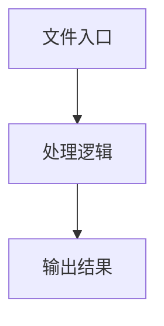

# utils.ts

## 0. 文件概述
utils.ts - TypeScript/JavaScript 源文件

## 1. 核心功能

### 1.1 导出项
- `export function deepMerge(target: any, source: any): any {`
- `export function getSystemChromePath(): string | undefined {`
- `export function getChromePathFromEnv(): string | undefined {`

### 1.2 类定义
- 无类定义

### 1.3 函数定义  
- **deepMerge()**: 函数
- **getSystemChromePath()**: 函数
- **getChromePathFromEnv()**: 函数

### 1.4 常量定义
- **output**: 常量
- **targetVal**: 常量
- **sourceVal**: 常量
- **platform**: 常量
- **isDocker**: 常量
- **chromePaths**: 常量
- **paths**: 常量
- **envChromePath**: 常量

## 2. 逻辑流程

**流程说明**: 该文件实现特定功能，通过导入依赖模块，定义类/函数/常量，并导出供其他模块使用。

## 3. 关键细节

### 3.1 核心变量
- **output**: 定义的常量
- **targetVal**: 定义的常量
- **sourceVal**: 定义的常量
- **platform**: 定义的常量
- **isDocker**: 定义的常量
- **chromePaths**: 定义的常量
- **paths**: 定义的常量
- **envChromePath**: 定义的常量

### 3.2 依赖项
- `import { existsSync } from 'node:fs';`
- `import {`

## 4. 跨文件调用关系

### 4.1 该文件调用的其他文件
根据 import 语句，该文件依赖以下模块：
- import { existsSync } from 'node:fs';
- import {

### 4.2 调用该文件的其他文件
该文件通过以下导出项被其他模块使用：
- export function deepMerge(target: any, source: any): any {
- export function getSystemChromePath(): string | undefined {
- export function getChromePathFromEnv(): string | undefined {
