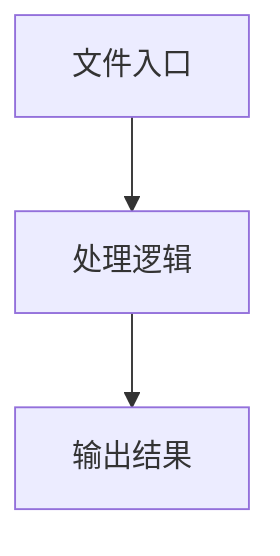

# agent-cli-side.ts

## 0. 文件概述
agent-cli-side.ts - TypeScript/JavaScript 源文件

## 1. 核心功能

### 1.1 导出项
- `export const getBridgePageInCliSide = (options?: {`
- `export class AgentOverChromeBridge extends Agent<ChromeExtensionPageCliSide> {`

### 1.2 类定义
- **AgentOverChromeBridge**: 类定义

### 1.3 函数定义  
- 无函数定义

### 1.4 常量定义
- **sleep**: 常量
- **getBridgePageInCliSide**: 常量
- **host**: 常量
- **port**: 常量
- **server**: 常量
- **bridgeCaller**: 常量
- **response**: 常量
- **page**: 常量
- **proxyPage**: 常量
- **mouse**: 常量
- **keyboard**: 常量
- **caller**: 常量
- **host**: 常量
- **page**: 常量
- **originalOnTaskStartTip**: 常量

## 2. 逻辑流程

**流程说明**: 该文件实现特定功能，通过导入依赖模块，定义类/函数/常量，并导出供其他模块使用。

## 3. 关键细节

### 3.1 核心变量
- **sleep**: 定义的常量
- **getBridgePageInCliSide**: 定义的常量
- **host**: 定义的常量
- **port**: 定义的常量
- **server**: 定义的常量
- **bridgeCaller**: 定义的常量
- **response**: 定义的常量
- **page**: 定义的常量
- **proxyPage**: 定义的常量
- **mouse**: 定义的常量
- **keyboard**: 定义的常量
- **caller**: 定义的常量
- **host**: 定义的常量
- **page**: 定义的常量
- **originalOnTaskStartTip**: 定义的常量

### 3.2 依赖项
- `import { Agent, type AgentOpt } from '@midscene/core/agent';`
- `import { assert } from '@midscene/shared/utils';`
- `import { commonWebActionsForWebPage } from '../web-page';`
- `import type { KeyboardAction, MouseAction } from '../web-page';`
- `import {`

（共 7 个导入项）

## 4. 跨文件调用关系

### 4.1 该文件调用的其他文件
根据 import 语句，该文件依赖以下模块：
- import { Agent, type AgentOpt } from '@midscene/core/agent';
- import { assert } from '@midscene/shared/utils';
- import { commonWebActionsForWebPage } from '../web-page';

### 4.2 调用该文件的其他文件
该文件通过以下导出项被其他模块使用：
- export const getBridgePageInCliSide = (options?: {
- export class AgentOverChromeBridge extends Agent<ChromeExtensionPageCliSide> {
