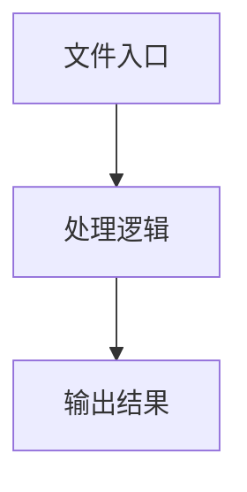

# common.ts

## 0. 文件概述
common.ts - TypeScript/JavaScript 源文件

## 1. 核心功能

### 1.1 导出项
- `export const DefaultBridgeServerHost = '127.0.0.1';`
- `export const DefaultBridgeServerPort = 3766;`
- `export const DefaultLocalEndpoint = `http://${DefaultBridgeServerHost}:${DefaultBridgeServerPort}`;`
- `export const BridgeCallTimeout = 30000;`
- `export function getBridgeServerHost(options?: {`
- `export enum BridgeEvent {`
- `export const BridgeSignalKill = 'MIDSCENE_BRIDGE_SIGNAL_KILL';`
- `export interface BridgeConnectTabOptions {`
- `export enum MouseEvent {`
- `export enum KeyboardEvent {`
- `export const BridgePageType = 'page-over-chrome-extension-bridge';`
- `export const BridgeErrorCodeNoClientConnected = 'no-client-connected';`
- `export interface BridgeCall {`
- `export interface BridgeCallRequest {`
- `export interface BridgeCallResponse {`
- `export interface BridgeConnectedEventPayload {`

### 1.2 类定义
- 无类定义

### 1.3 函数定义  
- **getBridgeServerHost()**: 函数

### 1.4 常量定义
- **DefaultBridgeServerHost**: 常量
- **DefaultBridgeServerPort**: 常量
- **DefaultLocalEndpoint**: 常量
- **BridgeCallTimeout**: 常量
- **BridgeSignalKill**: 常量
- **BridgePageType**: 常量
- **BridgeErrorCodeNoClientConnected**: 常量

## 2. 逻辑流程

**流程说明**: 该文件实现特定功能，通过导入依赖模块，定义类/函数/常量，并导出供其他模块使用。

## 3. 关键细节

### 3.1 核心变量
- **DefaultBridgeServerHost**: 定义的常量
- **DefaultBridgeServerPort**: 定义的常量
- **DefaultLocalEndpoint**: 定义的常量
- **BridgeCallTimeout**: 定义的常量
- **BridgeSignalKill**: 定义的常量
- **BridgePageType**: 定义的常量
- **BridgeErrorCodeNoClientConnected**: 定义的常量

### 3.2 依赖项
- 无外部依赖

## 4. 跨文件调用关系

### 4.1 该文件调用的其他文件
- 无外部调用

### 4.2 调用该文件的其他文件
该文件通过以下导出项被其他模块使用：
- export const DefaultBridgeServerHost = '127.0.0.1';
- export const DefaultBridgeServerPort = 3766;
- export const DefaultLocalEndpoint = `http://${DefaultBridgeServerHost}:${DefaultBridgeServerPort}`;
