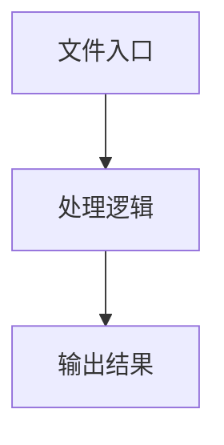

# page-browser-side.ts

## 0. 文件概述
page-browser-side.ts - TypeScript/JavaScript 源文件

## 1. 核心功能

### 1.1 导出项
- `export class ExtensionBridgePageBrowserSide extends ChromeExtensionProxyPage {`

### 1.2 类定义
- **ExtensionBridgePageBrowserSide**: 类定义

### 1.3 函数定义  
- 无函数定义

### 1.4 常量定义
- **endpoint**: 常量
- **tabId**: 常量
- **actionName**: 常量
- **actionName**: 常量
- **result**: 常量
- **errorMessage**: 常量
- **tab**: 常量
- **tabId**: 常量
- **tabs**: 常量
- **tabId**: 常量

## 2. 逻辑流程

**流程说明**: 该文件实现特定功能，通过导入依赖模块，定义类/函数/常量，并导出供其他模块使用。

## 3. 关键细节

### 3.1 核心变量
- **endpoint**: 定义的常量
- **tabId**: 定义的常量
- **actionName**: 定义的常量
- **actionName**: 定义的常量
- **result**: 定义的常量
- **errorMessage**: 定义的常量
- **tab**: 定义的常量
- **tabId**: 定义的常量
- **tabs**: 定义的常量
- **tabId**: 定义的常量

### 3.2 依赖项
- `import { assert } from '@midscene/shared/utils';`
- `import ChromeExtensionProxyPage from '../chrome-extension/page';`
- `import type {`
- `import {`
- `import { BridgeClient } from './io-client';`

## 4. 跨文件调用关系

### 4.1 该文件调用的其他文件
根据 import 语句，该文件依赖以下模块：
- import { assert } from '@midscene/shared/utils';
- import ChromeExtensionProxyPage from '../chrome-extension/page';
- import type {

### 4.2 调用该文件的其他文件
该文件通过以下导出项被其他模块使用：
- export class ExtensionBridgePageBrowserSide extends ChromeExtensionProxyPage {
