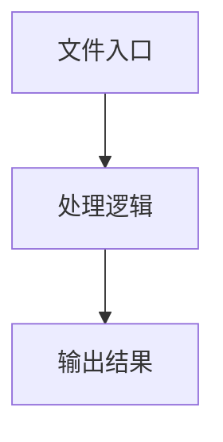

# cdpInput.ts

## 0. 文件概述
cdpInput.ts - TypeScript/JavaScript 源文件

## 1. 核心功能

### 1.1 导出项
- `export interface KeyDownOptions {`
- `export interface KeyboardTypeOptions {`
- `export type KeyPressOptions = KeyDownOptions & KeyboardTypeOptions;`
- `export class CdpKeyboard {`

### 1.2 类定义
- **CdpKeyboard**: 类定义

### 1.3 函数定义  
- 无函数定义

### 1.4 常量定义
- **description**: 常量
- **autoRepeat**: 常量
- **text**: 常量
- **shift**: 常量
- **description**: 常量
- **definition**: 常量
- **description**: 常量
- **delay**: 常量
- **keys**: 常量

## 2. 逻辑流程

**流程说明**: 该文件实现特定功能，通过导入依赖模块，定义类/函数/常量，并导出供其他模块使用。

## 3. 关键细节

### 3.1 核心变量
- **description**: 定义的常量
- **autoRepeat**: 定义的常量
- **text**: 定义的常量
- **shift**: 定义的常量
- **description**: 定义的常量
- **definition**: 定义的常量
- **description**: 定义的常量
- **delay**: 定义的常量
- **keys**: 定义的常量

### 3.2 依赖项
- `import {`
- `import { assert } from '@midscene/shared/utils';`

## 4. 跨文件调用关系

### 4.1 该文件调用的其他文件
根据 import 语句，该文件依赖以下模块：
- import {
- import { assert } from '@midscene/shared/utils';

### 4.2 调用该文件的其他文件
该文件通过以下导出项被其他模块使用：
- export interface KeyDownOptions {
- export interface KeyboardTypeOptions {
- export type KeyPressOptions = KeyDownOptions & KeyboardTypeOptions;
