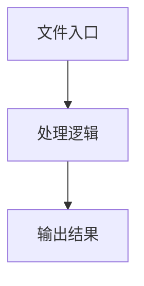

# page.ts

## 0. 文件概述
page.ts - TypeScript/JavaScript 源文件

## 1. 核心功能

### 1.1 导出项
- `export default class ChromeExtensionProxyPage implements AbstractInterface {`

### 1.2 类定义
- **ChromeExtensionProxyPage**: 类定义

### 1.3 函数定义  
- **sleep()**: 函数
- **in()**: 函数

### 1.4 常量定义
- **tabs**: 常量
- **tabId**: 常量
- **url**: 常量
- **tabId**: 常量
- **errorMsg**: 常量
- **pointerScript**: 常量
- **tabIdToDetach**: 常量
- **tabId**: 常量
- **script**: 常量
- **script**: 常量
- **MAX_RETRIES**: 常量
- **tabId**: 常量
- **result**: 常量
- **errorMsg**: 常量
- **isDetachError**: 常量
- **script**: 常量
- **expression**: 常量
- **tree**: 常量
- **returnValue**: 常量
- **errorDescription**: 常量
- **timeout**: 常量
- **startTime**: 常量
- **result**: 常量
- **tree**: 常量
- **script**: 常量
- **result**: 常量
- **script**: 常量
- **result**: 常量
- **content**: 常量
- **result**: 常量
- **sizeInfo**: 常量
- **format**: 常量
- **base64**: 常量
- **tabId**: 常量
- **url**: 常量
- **tabId**: 常量
- **tabId**: 常量
- **tabId**: 常量
- **scrollDistance**: 常量
- **scrollDistance**: 常量
- **scrollDistance**: 常量
- **scrollDistance**: 常量
- **result**: 常量
- **touchPoints**: 常量
- **finalX**: 常量
- **finalY**: 常量
- **cdpKeyboard**: 常量
- **cdpKeyboard**: 常量
- **keys**: 常量
- **commands**: 常量
- **LONG_PRESS_THRESHOLD**: 常量
- **MIN_PRESS_THRESHOLD**: 常量
- **result**: 常量
- **touchPoints**: 常量
- **LONG_PRESS_THRESHOLD**: 常量
- **MIN_PRESS_THRESHOLD**: 常量
- **result**: 常量
- **steps**: 常量
- **delay**: 常量
- **x**: 常量
- **y**: 常量
- **x**: 常量
- **y**: 常量

## 2. 逻辑流程

**流程说明**: 该文件实现特定功能，通过导入依赖模块，定义类/函数/常量，并导出供其他模块使用。

## 3. 关键细节

### 3.1 核心变量
- **tabs**: 定义的常量
- **tabId**: 定义的常量
- **url**: 定义的常量
- **tabId**: 定义的常量
- **errorMsg**: 定义的常量
- **pointerScript**: 定义的常量
- **tabIdToDetach**: 定义的常量
- **tabId**: 定义的常量
- **script**: 定义的常量
- **script**: 定义的常量
- **MAX_RETRIES**: 定义的常量
- **tabId**: 定义的常量
- **result**: 定义的常量
- **errorMsg**: 定义的常量
- **isDetachError**: 定义的常量
- **script**: 定义的常量
- **expression**: 定义的常量
- **tree**: 定义的常量
- **returnValue**: 定义的常量
- **errorDescription**: 定义的常量
- **timeout**: 定义的常量
- **startTime**: 定义的常量
- **result**: 定义的常量
- **tree**: 定义的常量
- **script**: 定义的常量
- **result**: 定义的常量
- **script**: 定义的常量
- **result**: 定义的常量
- **content**: 定义的常量
- **result**: 定义的常量
- **sizeInfo**: 定义的常量
- **format**: 定义的常量
- **base64**: 定义的常量
- **tabId**: 定义的常量
- **url**: 定义的常量
- **tabId**: 定义的常量
- **tabId**: 定义的常量
- **tabId**: 定义的常量
- **scrollDistance**: 定义的常量
- **scrollDistance**: 定义的常量
- **scrollDistance**: 定义的常量
- **scrollDistance**: 定义的常量
- **result**: 定义的常量
- **touchPoints**: 定义的常量
- **finalX**: 定义的常量
- **finalY**: 定义的常量
- **cdpKeyboard**: 定义的常量
- **cdpKeyboard**: 定义的常量
- **keys**: 定义的常量
- **commands**: 定义的常量
- **LONG_PRESS_THRESHOLD**: 定义的常量
- **MIN_PRESS_THRESHOLD**: 定义的常量
- **result**: 定义的常量
- **touchPoints**: 定义的常量
- **LONG_PRESS_THRESHOLD**: 定义的常量
- **MIN_PRESS_THRESHOLD**: 定义的常量
- **result**: 定义的常量
- **steps**: 定义的常量
- **delay**: 定义的常量
- **x**: 定义的常量
- **y**: 定义的常量
- **x**: 定义的常量
- **y**: 定义的常量

### 3.2 依赖项
- `import { limitOpenNewTabScript } from '@/web-element';`
- `import type { ElementTreeNode, Point, Size, UIContext } from '@midscene/core';`
- `import type { AbstractInterface, DeviceAction } from '@midscene/core/device';`
- `import type { ElementInfo } from '@midscene/shared/extractor';`
- `import { treeToList } from '@midscene/shared/extractor';`

（共 12 个导入项）

## 4. 跨文件调用关系

### 4.1 该文件调用的其他文件
根据 import 语句，该文件依赖以下模块：
- import { limitOpenNewTabScript } from '@/web-element';
- import type { ElementTreeNode, Point, Size, UIContext } from '@midscene/core';
- import type { AbstractInterface, DeviceAction } from '@midscene/core/device';

### 4.2 调用该文件的其他文件
该文件通过以下导出项被其他模块使用：
- export default class ChromeExtensionProxyPage implements AbstractInterface {
