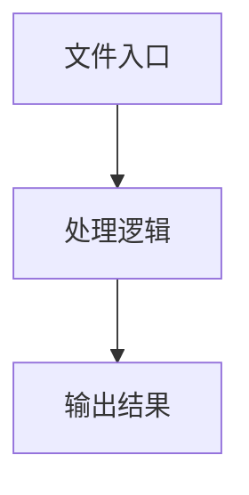

# ai-fixture.ts

## 0. 文件概述
ai-fixture.ts - TypeScript/JavaScript 源文件

## 1. 核心功能

### 1.1 导出项
- `export type APITestType = Pick<TestType<any, any>, 'step'>;`
- `export const midsceneDumpAnnotationId = 'MIDSCENE_DUMP_ANNOTATION';`
- `export const PlaywrightAiFixture = (options?: {`
- `export type PlayWrightAiFixtureType = {`

### 1.2 类定义
- 无类定义

### 1.3 函数定义  
- **to()**: 函数
- **generateAiFunction()**: 函数

### 1.4 常量定义
- **debugPage**: 常量
- **groupAndCaseForTest**: 常量
- **titlePath**: 常量
- **taskTitleWithRetry**: 常量
- **midsceneAgentKeyId**: 常量
- **midsceneDumpAnnotationId**: 常量
- **pageTempFiles**: 常量
- **PlaywrightAiFixture**: 常量
- **processTestCacheConfig**: 常量
- **pageAgentMap**: 常量
- **createOrReuseAgentForPage**: 常量
- **cacheConfig**: 常量
- **agent**: 常量
- **result**: 常量
- **updateDumpAnnotation**: 常量
- **oldTempFilePath**: 常量
- **tempFileName**: 常量
- **tempFilePath**: 常量
- **currentAnnotation**: 常量
- **cacheConfig**: 常量
- **userCache**: 常量
- **agent**: 常量

## 2. 逻辑流程

**流程说明**: 该文件实现特定功能，通过导入依赖模块，定义类/函数/常量，并导出供其他模块使用。

## 3. 关键细节

### 3.1 核心变量
- **debugPage**: 定义的常量
- **groupAndCaseForTest**: 定义的常量
- **titlePath**: 定义的常量
- **taskTitleWithRetry**: 定义的常量
- **midsceneAgentKeyId**: 定义的常量
- **midsceneDumpAnnotationId**: 定义的常量
- **pageTempFiles**: 定义的常量
- **PlaywrightAiFixture**: 定义的常量
- **processTestCacheConfig**: 定义的常量
- **pageAgentMap**: 定义的常量
- **createOrReuseAgentForPage**: 定义的常量
- **cacheConfig**: 定义的常量
- **agent**: 定义的常量
- **result**: 定义的常量
- **updateDumpAnnotation**: 定义的常量
- **oldTempFilePath**: 定义的常量
- **tempFileName**: 定义的常量
- **tempFilePath**: 定义的常量
- **currentAnnotation**: 定义的常量
- **cacheConfig**: 定义的常量
- **userCache**: 定义的常量
- **agent**: 定义的常量

### 3.2 依赖项
- `import { rmSync, writeFileSync } from 'node:fs';`
- `import { tmpdir } from 'node:os';`
- `import { join } from 'node:path';`
- `import { PlaywrightAgent, type PlaywrightWebPage } from '@/playwright/index';`
- `import type { WebPageAgentOpt } from '@/web-element';`

（共 14 个导入项）

## 4. 跨文件调用关系

### 4.1 该文件调用的其他文件
根据 import 语句，该文件依赖以下模块：
- import { rmSync, writeFileSync } from 'node:fs';
- import { tmpdir } from 'node:os';
- import { join } from 'node:path';

### 4.2 调用该文件的其他文件
该文件通过以下导出项被其他模块使用：
- export type APITestType = Pick<TestType<any, any>, 'step'>;
- export const midsceneDumpAnnotationId = 'MIDSCENE_DUMP_ANNOTATION';
- export const PlaywrightAiFixture = (options?: {
