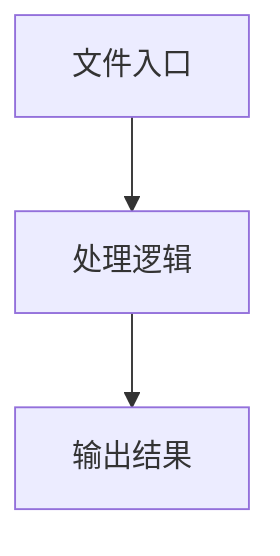

# agent-launcher.ts

## 0. 文件概述
agent-launcher.ts - TypeScript/JavaScript 源文件

## 1. 核心功能

### 1.1 导出项
- `export const defaultUA =`
- `export const defaultViewportWidth = 1440;`
- `export const defaultViewportHeight = 768;`
- `export const defaultViewportScale = process.platform === 'darwin' ? 2 : 1;`
- `export const defaultWaitForNetworkIdleTimeout =`
- `export function resolveAiActionContext(`
- `export async function launchPuppeteerPage(`
- `export async function puppeteerAgentForTarget(`

### 1.2 类定义
- 无类定义

### 1.3 函数定义  
- **resolveAiActionContext()**: 函数
- **filters()**: 函数
- **validateChromeArgs()**: 函数
- **launchPuppeteerPage()**: 函数
- **puppeteerAgentForTarget()**: 函数

### 1.4 常量定义
- **defaultUA**: 常量
- **defaultViewportWidth**: 常量
- **defaultViewportHeight**: 常量
- **defaultViewportScale**: 常量
- **defaultWaitForNetworkIdleTimeout**: 常量
- **data**: 常量
- **DANGEROUS_ARGS**: 常量
- **newArgs**: 常量
- **argFlag**: 常量
- **baseFlag**: 常量
- **dangerousArgs**: 常量
- **launcherDebug**: 常量
- **freeFn**: 常量
- **ua**: 常量
- **viewportConfig**: 常量
- **headed**: 常量
- **windowSizeArg**: 常量
- **defaultViewportConfig**: 常量
- **isWindows**: 常量
- **baseArgs**: 常量
- **page**: 常量
- **cookieFileContent**: 常量
- **waitForNetworkIdleTimeout**: 常量
- **newError**: 常量
- **newMessage**: 常量
- **aiActContext**: 常量
- **agent**: 常量

## 2. 逻辑流程

**流程说明**: 该文件实现特定功能，通过导入依赖模块，定义类/函数/常量，并导出供其他模块使用。

## 3. 关键细节

### 3.1 核心变量
- **defaultUA**: 定义的常量
- **defaultViewportWidth**: 定义的常量
- **defaultViewportHeight**: 定义的常量
- **defaultViewportScale**: 定义的常量
- **defaultWaitForNetworkIdleTimeout**: 定义的常量
- **data**: 定义的常量
- **DANGEROUS_ARGS**: 定义的常量
- **newArgs**: 定义的常量
- **argFlag**: 定义的常量
- **baseFlag**: 定义的常量
- **dangerousArgs**: 定义的常量
- **launcherDebug**: 定义的常量
- **freeFn**: 定义的常量
- **ua**: 定义的常量
- **viewportConfig**: 定义的常量
- **headed**: 定义的常量
- **windowSizeArg**: 定义的常量
- **defaultViewportConfig**: 定义的常量
- **isWindows**: 定义的常量
- **baseArgs**: 定义的常量
- **page**: 定义的常量
- **cookieFileContent**: 定义的常量
- **waitForNetworkIdleTimeout**: 定义的常量
- **newError**: 定义的常量
- **newMessage**: 定义的常量
- **aiActContext**: 定义的常量
- **agent**: 定义的常量

### 3.2 依赖项
- `import { readFileSync } from 'node:fs';`
- `import { getDebug } from '@midscene/shared/logger';`
- `import { assert } from '@midscene/shared/utils';`
- `import { PuppeteerAgent } from '@/puppeteer/index';`
- `import type { AgentOpt, Cache, MidsceneYamlScriptWebEnv } from '@midscene/core';`

（共 7 个导入项）

## 4. 跨文件调用关系

### 4.1 该文件调用的其他文件
根据 import 语句，该文件依赖以下模块：
- import { readFileSync } from 'node:fs';
- import { getDebug } from '@midscene/shared/logger';
- import { assert } from '@midscene/shared/utils';

### 4.2 调用该文件的其他文件
该文件通过以下导出项被其他模块使用：
- export const defaultUA =
- export const defaultViewportWidth = 1440;
- export const defaultViewportHeight = 768;
