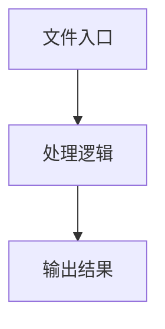

# base-page.ts

## 0. 文件概述
base-page.ts - TypeScript/JavaScript 源文件

## 1. 核心功能

### 1.1 导出项
- `export const debugPage = getDebug('web:page');`
- `export class Page<`
- `export function forceClosePopup(`
- `export function forceChromeSelectRendering(`

### 1.2 类定义
- **Page**: 类定义

### 1.3 函数定义  
- **begin()**: 函数
- **end()**: 函数
- **forceClosePopup()**: 函数
- **forceChromeSelectRendering()**: 函数

### 1.4 常量定义
- **debugPage**: 常量
- **sanitizeXpaths**: 常量
- **defaultActions**: 常量
- **customActions**: 常量
- **tree**: 常量
- **elementInfosScriptContent**: 常量
- **elementInfosScriptContent**: 常量
- **center**: 常量
- **judgeResult**: 常量
- **xpaths**: 常量
- **sanitized**: 常量
- **webFeature**: 常量
- **xpaths**: 常量
- **elementInfo**: 常量
- **matchedRect**: 常量
- **scripts**: 常量
- **startTime**: 常量
- **captureElementSnapshot**: 常量
- **endTime**: 常量
- **sizeInfo**: 常量
- **imgType**: 常量
- **quality**: 常量
- **startTime**: 常量
- **result**: 常量
- **buffer**: 常量
- **endTime**: 常量
- **url**: 常量
- **keys**: 常量
- **commands**: 常量
- **backspace**: 常量
- **isMac**: 常量
- **size**: 常量
- **targetX**: 常量
- **targetY**: 常量
- **innerHeight**: 常量
- **scrollDistance**: 常量
- **innerHeight**: 常量
- **scrollDistance**: 常量
- **innerWidth**: 常量
- **scrollDistance**: 常量
- **innerWidth**: 常量
- **scrollDistance**: 常量
- **LONG_PRESS_THRESHOLD**: 常量
- **MIN_PRESS_THRESHOLD**: 常量
- **page**: 常量
- **steps**: 常量
- **delay**: 常量
- **x**: 常量
- **y**: 常量
- **page**: 常量
- **steps**: 常量
- **delay**: 常量
- **x**: 常量
- **y**: 常量
- **LONG_PRESS_THRESHOLD**: 常量
- **MIN_PRESS_THRESHOLD**: 常量
- **page**: 常量
- **page**: 常量
- **url**: 常量
- **styleContent**: 常量
- **styleId**: 常量
- **injectStyle**: 常量
- **style**: 常量

## 2. 逻辑流程

**流程说明**: 该文件实现特定功能，通过导入依赖模块，定义类/函数/常量，并导出供其他模块使用。

## 3. 关键细节

### 3.1 核心变量
- **debugPage**: 定义的常量
- **sanitizeXpaths**: 定义的常量
- **defaultActions**: 定义的常量
- **customActions**: 定义的常量
- **tree**: 定义的常量
- **elementInfosScriptContent**: 定义的常量
- **elementInfosScriptContent**: 定义的常量
- **center**: 定义的常量
- **judgeResult**: 定义的常量
- **xpaths**: 定义的常量
- **sanitized**: 定义的常量
- **webFeature**: 定义的常量
- **xpaths**: 定义的常量
- **elementInfo**: 定义的常量
- **matchedRect**: 定义的常量
- **scripts**: 定义的常量
- **startTime**: 定义的常量
- **captureElementSnapshot**: 定义的常量
- **endTime**: 定义的常量
- **sizeInfo**: 定义的常量
- **imgType**: 定义的常量
- **quality**: 定义的常量
- **startTime**: 定义的常量
- **result**: 定义的常量
- **buffer**: 定义的常量
- **endTime**: 定义的常量
- **url**: 定义的常量
- **keys**: 定义的常量
- **commands**: 定义的常量
- **backspace**: 定义的常量
- **isMac**: 定义的常量
- **size**: 定义的常量
- **targetX**: 定义的常量
- **targetY**: 定义的常量
- **innerHeight**: 定义的常量
- **scrollDistance**: 定义的常量
- **innerHeight**: 定义的常量
- **scrollDistance**: 定义的常量
- **innerWidth**: 定义的常量
- **scrollDistance**: 定义的常量
- **innerWidth**: 定义的常量
- **scrollDistance**: 定义的常量
- **LONG_PRESS_THRESHOLD**: 定义的常量
- **MIN_PRESS_THRESHOLD**: 定义的常量
- **page**: 定义的常量
- **steps**: 定义的常量
- **delay**: 定义的常量
- **x**: 定义的常量
- **y**: 定义的常量
- **page**: 定义的常量
- **steps**: 定义的常量
- **delay**: 定义的常量
- **x**: 定义的常量
- **y**: 定义的常量
- **LONG_PRESS_THRESHOLD**: 定义的常量
- **MIN_PRESS_THRESHOLD**: 定义的常量
- **page**: 定义的常量
- **page**: 定义的常量
- **url**: 定义的常量
- **styleContent**: 定义的常量
- **styleId**: 定义的常量
- **injectStyle**: 定义的常量
- **style**: 定义的常量

### 3.2 依赖项
- `import { type WebPageAgentOpt, WebPageContextParser } from '@/web-element';`
- `import type {`
- `import {`
- `import type { AbstractInterface } from '@midscene/core/device';`
- `import { sleep } from '@midscene/core/utils';`

（共 16 个导入项）

## 4. 跨文件调用关系

### 4.1 该文件调用的其他文件
根据 import 语句，该文件依赖以下模块：
- import { type WebPageAgentOpt, WebPageContextParser } from '@/web-element';
- import type {
- import {

### 4.2 调用该文件的其他文件
该文件通过以下导出项被其他模块使用：
- export const debugPage = getDebug('web:page');
- export class Page<
- export function forceClosePopup(
