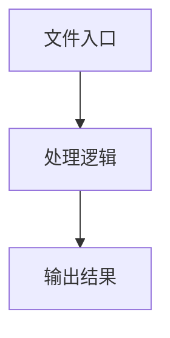

# web-element.ts

## 0. 文件概述
web-element.ts - TypeScript/JavaScript 源文件

## 1. 核心功能

### 1.1 导出项
- `export type { WebElementInfo };`
- `export type WebPageAgentOpt = AgentOpt & WebPageOpt;`
- `export type WebPageOpt = {`
- `export type WebPage =`
- `export class WebElementInfoImpl implements WebElementInfo {`
- `export async function WebPageContextParser(`
- `export const limitOpenNewTabScript = ``

### 1.2 类定义
- **WebElementInfoImpl**: 类定义

### 1.3 函数定义  
- **WebPageContextParser()**: 函数

### 1.4 常量定义
- **debug**: 常量
- **basicContext**: 常量
- **limitOpenNewTabScript**: 常量
- **target**: 常量

## 2. 逻辑流程

**流程说明**: 该文件实现特定功能，通过导入依赖模块，定义类/函数/常量，并导出供其他模块使用。

## 3. 关键细节

### 3.1 核心变量
- **debug**: 定义的常量
- **basicContext**: 定义的常量
- **limitOpenNewTabScript**: 定义的常量
- **target**: 定义的常量

### 3.2 依赖项
- `import type {`
- `import type { AbstractInterface } from '@midscene/core/device';`
- `import { getDebug } from '@midscene/shared/logger';`
- `import { _keyDefinitions } from '@midscene/shared/us-keyboard-layout';`
- `import { commonContextParser } from '@midscene/core/agent';`

（共 10 个导入项）

## 4. 跨文件调用关系

### 4.1 该文件调用的其他文件
根据 import 语句，该文件依赖以下模块：
- import type {
- import type { AbstractInterface } from '@midscene/core/device';
- import { getDebug } from '@midscene/shared/logger';

### 4.2 调用该文件的其他文件
该文件通过以下导出项被其他模块使用：
- export type { WebElementInfo };
- export type WebPageAgentOpt = AgentOpt & WebPageOpt;
- export type WebPageOpt = {
