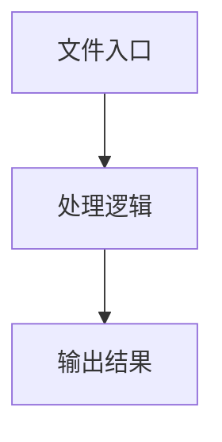

# web-page.ts

## 0. 文件概述
web-page.ts - TypeScript/JavaScript 源文件

## 1. 核心功能

### 1.1 导出项
- `export function getKeyCommands(`
- `export declare type KeyInput =`
- `export type MouseButton = 'left' | 'right' | 'middle';`
- `export interface MouseAction {`
- `export interface KeyboardAction {`
- `export interface ChromePageDestroyOptions {`
- `export abstract class AbstractWebPage extends AbstractInterface {`
- `export const commonWebActionsForWebPage = <T extends AbstractWebPage>(`

### 1.2 类定义
- **AbstractWebPage**: 类定义

### 1.3 函数定义  
- **normalizeKeyInputs()**: 函数
- **getKeyCommands()**: 函数

### 1.4 常量定义
- **debug**: 常量
- **inputs**: 常量
- **result**: 常量
- **trimmed**: 常量
- **transformed**: 常量
- **keys**: 常量
- **includeMeta**: 常量
- **commonWebActionsForWebPage**: 常量
- **element**: 常量
- **element**: 常量
- **element**: 常量
- **element**: 常量
- **element**: 常量
- **element**: 常量
- **keys**: 常量
- **element**: 常量
- **startingPoint**: 常量
- **scrollToEventName**: 常量
- **from**: 常量
- **to**: 常量
- **element**: 常量
- **duration**: 常量
- **startPoint**: 常量
- **direction**: 常量
- **duration**: 常量
- **element**: 常量

## 2. 逻辑流程

**流程说明**: 该文件实现特定功能，通过导入依赖模块，定义类/函数/常量，并导出供其他模块使用。

## 3. 关键细节

### 3.1 核心变量
- **debug**: 定义的常量
- **inputs**: 定义的常量
- **result**: 定义的常量
- **trimmed**: 定义的常量
- **transformed**: 定义的常量
- **keys**: 定义的常量
- **includeMeta**: 定义的常量
- **commonWebActionsForWebPage**: 定义的常量
- **element**: 定义的常量
- **element**: 定义的常量
- **element**: 定义的常量
- **element**: 定义的常量
- **element**: 定义的常量
- **element**: 定义的常量
- **keys**: 定义的常量
- **element**: 定义的常量
- **startingPoint**: 定义的常量
- **scrollToEventName**: 定义的常量
- **from**: 定义的常量
- **to**: 定义的常量
- **element**: 定义的常量
- **duration**: 定义的常量
- **startPoint**: 定义的常量
- **direction**: 定义的常量
- **duration**: 定义的常量
- **element**: 定义的常量

### 3.2 依赖项
- `import assert from 'node:assert';`
- `import type { Point } from '@midscene/core';`
- `import { z } from '@midscene/core';`
- `import {`
- `import { sleep } from '@midscene/core/utils';`

（共 8 个导入项）

## 4. 跨文件调用关系

### 4.1 该文件调用的其他文件
根据 import 语句，该文件依赖以下模块：
- import assert from 'node:assert';
- import type { Point } from '@midscene/core';
- import { z } from '@midscene/core';

### 4.2 调用该文件的其他文件
该文件通过以下导出项被其他模块使用：
- export function getKeyCommands(
- export declare type KeyInput =
- export type MouseButton = 'left' | 'right' | 'middle';
