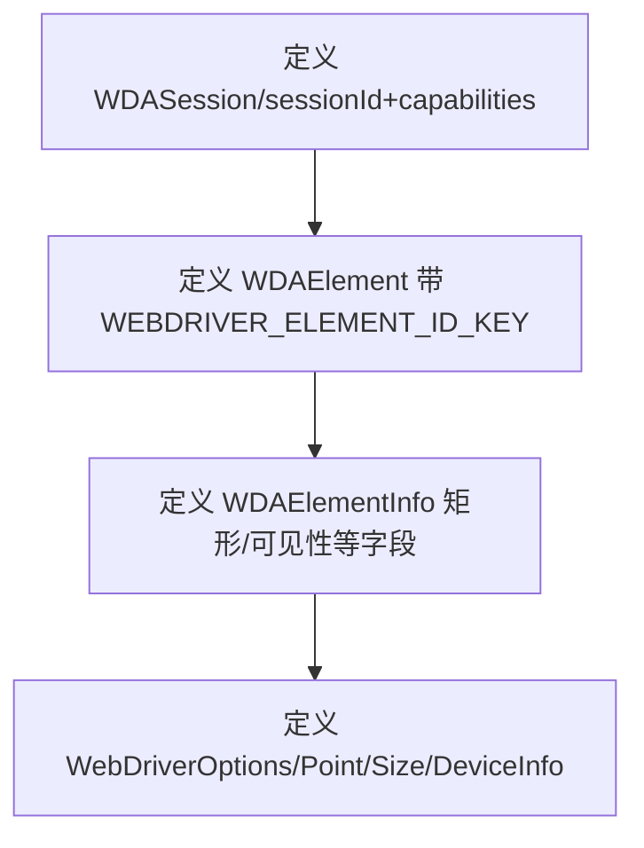

# 核心功能
- 定义 WebDriverAgent 相关的基础类型：会话信息、元素描述、设备信息及坐标尺寸。
- 统一约束客户端与服务端交互的数据结构，保证跨模块字段命名一致。

# 逻辑流程

# 关键细节
- 核心变量：`WDASession` 描述当前会话；`WDAElement` 同时包含旧版 `ELEMENT` 与 `WEBDRIVER_ELEMENT_ID_KEY` 字段；`WDAElementInfo` 携带类型、矩形、可用性等属性。
- 条件逻辑：无运行时逻辑，仅声明接口。
- 异常处理：无。
- 数据流：类型被其他模块引用，用于描述请求/响应结构，确保输入输出字段统一。

# 跨文件调用关系
- 本文件调用：依赖 `@midscene/shared/constants` 中的 `WEBDRIVER_ELEMENT_ID_KEY` 常量用于兼容元素 id。
- 被调用场景：`WebDriverClient` 使用 `WebDriverOptions/WDASession/DeviceInfo/Size` 类型；`src/index.ts` 重新导出供外部使用，确保调用方按同一结构组织数据。
