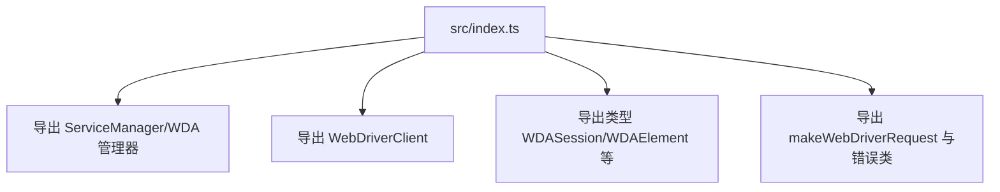

# 核心功能
- 作为 webdriver 包的聚合出口，集中导出服务管理器、客户端及相关类型/工具。
- 提供统一入口，方便其他包通过单一导入获取管理器、客户端、类型定义与请求工具。

# 逻辑流程

# 关键细节
- 核心变量：无运行时逻辑，仅整理导出路径；使用 type/export 组合保证类型与实现可按需引用。
- 条件判断/异常处理：无。
- 数据流：将各模块符号重新导出，供上层模块 import。

# 跨文件调用关系
- 本文件调用：引用 `./managers/ServiceManager`、`./managers/WDAManager`、`./clients/WebDriverClient`、`./clients/types`、`./utils/request`。
- 被调用场景：包外使用者通过 `import { WebDriverClient } from '@midscene/webdriver'` 等方式访问全部功能；也是目录级出口被其他包索引文件进一步转发的入口。
