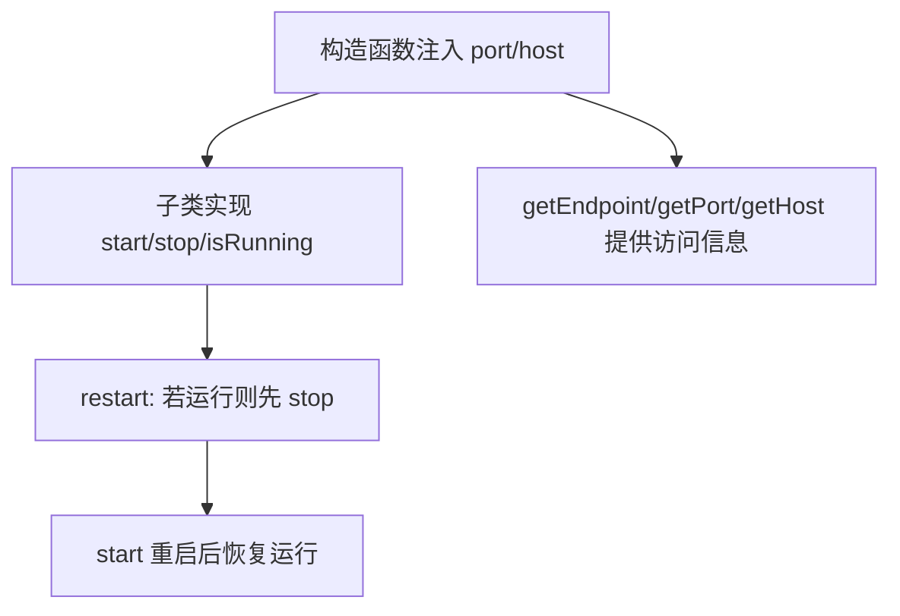

# 核心功能
- 统一定义 WebDriver 服务管理器接口，并提供基础抽象类，封装端口/主机信息和重启逻辑。
- 通过 `WebDriverServiceManager` 约束 start/stop/restart 等生命周期方法，便于不同后端实现共享一致的控制入口。
- `BaseServiceManager` 内置端点拼装、主机端口访问器，减少具体实现重复代码。

# 逻辑流程

# 关键细节
- 核心变量：`port`、`host` 保存服务监听信息；由构造函数注入默认 host=localhost。
- 条件判断：`restart` 先检查 `isRunning()`，避免重复启动；未运行时直接调用 `start`。
- 异常处理：抽象类不处理异常，交由具体实现决定；接口保证调用方按约定实现。
- 数据流：输入为构造参数 port/host；封装为 `getEndpoint` 拼接 `http://${host}:${port}` 输出供其他模块调用。

# 跨文件调用关系
- 本文件调用：无跨文件调用，仅定义接口/抽象类。
- 被调用场景：`WDAManager` 继承 `BaseServiceManager` 复用端点/重启逻辑；`src/index.ts` 通过 `export` 暴露类型和基类供外部统一使用。
